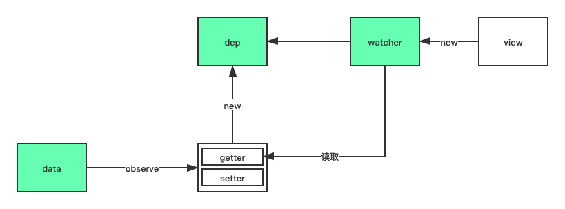

# 从源码看 watch 和 computed

    Vue2 版本：2.6.11

## Vue 的响应式流程

了解`computed`和`watch`之前，让我们先了解一下 Vue 的响应式。

话不多说，先上图：


整个响应式的实现大致如下：

1. `observe`将`data`包裹为响应式数据，并通过`dep`存放依赖
2. `render`时会`new`一个`watcher`来订阅数据的改变
3. `wacher`的构造函数会对被观测的数据执行`getter`，将`watcher`收集到`dep`中
4. 数据发生改变时，通过`setter`中的`dep.notify()`通知到各个`watcher`
5. `watcher`执行`update`，将变化更新到页面

（注：为了更好的理解，下文的代码相较于源码，有所改动或简化）

### observer

Vue 初始化过程中，在`beforeCreate`->`created`过程中，会执行`initData`将`data`中的数据初始化为响应式数据。而`initData`的核心就是`observer`，`observer`中的`defineReactive()`利用`Object.defineProperty()`进行数据劫持。

```js
function defineReactive(obj, key, val) {
  Object.defineProperty(obj, key, {
    get() {
      //报告！数据被读取了！
      return val;
    },
    set(newVal) {
      if (newVal === val) return;
      //报告！数据改变了！做一些数据改变该做的事情
      val = newVal;
    },
  });
}
```

### dep

响应式数据有了，那么数据发生变动，应该通知谁呢？
显然，Vue 使用了发布订阅模式，数据发生改变，自然是通知订阅者。但往往一个数据的改变，不止一个订阅者，那么我们如何确保每个订阅者都能收到通知呢？
铛铛铛！`dep`闪亮登场！前面说到，`defineReactive()`会将数据变成响应式，而在这个过程中，我们利用闭包原理，为每个数据创建一个仓库，专门用来放置这个数据的订阅者。

```js
class Dep {
  // 我是一个无情的依赖收集器
  constructor() {
    this.subs = [];
  }
}
function defineReactive(obj, key, val) {
  const dep = new Dep();
  Object.defineProperty(obj, key, {
    get() {
      //报告！数据被读取了！
      return val;
    },
    set(newVal) {
      if (newVal === val) return;
      dep.notify(); //报告！数据改变了！做一些数据改变该做的事情
      val = newVal;
    },
  });
}
```

### watcher

emmmm...说好的订阅者呢？别急！
我们来看看`watcher`：

```js
class Dep {
  constructor() {
    this.subs = [];
  }

  addSub(sub: Watcher) {
    // 把watcher放进subs咯
    this.subs.push(sub);
  }

  depend() {
    if (Dep.target) {
      Dep.target.addDep(this);
    }
  }

  notify() {
    for (let i = 0, l = subs.length; i < l; i++) {
      // 执行watcher中的update()
      subs[i].update();
    }
  }
}
function defineReactive(obj, key, val) {
  const dep = new Dep(); // 我是一个无情的依赖收集器
  Object.defineProperty(obj, key, {
    get() {
      //报告！数据被读取了！
      if (Dep.target) {
        // Dep.target就是当前watcher喔
        dep.depend();
      }
      return val;
    },
    set(newVal) {
      if (newVal === val) return;
      dep.notify(); //报告！数据改变了！做一些数据改变该做的事情
      val = newVal;
    },
  });
}
export default class Watcher {
  constructor(vm: Component, expOrFn: string | Function, cb: Function) {
    this.cb = cb;
    this.expression =
      process.env.NODE_ENV !== "production" ? expOrFn.toString() : "";
    // parse expression for getter
    if (typeof expOrFn === "function") {
      this.getter = expOrFn;
    } else {
      this.getter = parsePath(expOrFn);
    }
    this.value = this.get();
  }

  /**
   * Evaluate the getter, and re-collect dependencies.
   */
  get() {
    const vm = this.vm;
    // 通过执行getter读取数据，触发响应式数据的get操作，将watcher加入dep中
    return this.getter.call(vm, vm);
  }

  /**
   * Subscriber interface.
   * Will be called when a dependency changes.
   */
  update() {}
}
```

wow！原来`watcher`就是那个订阅者，将需要侦听的数据或者表达式通过`this.get()`触发数据中的`getter()`，从而将订阅者`watcher`加入`dep`中，数据变动时，通过`dep.notify()`通知到`dep`，遍历`subs`执行`watcher.update()`。

## watch/computed

`watch`是侦听属性，用于观察和响应实例上的某个数据变化，而`watcher`是`watch`的底层实现。
除了显式的在实例中声明`watch`或者直接使用`vm.$watch()`，每个组件都有自己的`renderWatcher`，`computed`的实现，也依赖于`watcher`。

### renderWatcher

组件`data`中的数据发生变化时，会及时更新到页面，而订阅者就是`renderWatcher`。
beforeMount --> mounted 过程中，会执行如下操作，收集`render`中会使用到的参数，并订阅其变化。

```js
const updateComponent = () => {
  // vm._render获取VNode
  vm._update(vm._render(), hydrating);
};
new Watcher(
  vm,
  updateComponent,
  noop,
  {
    before() {
      if (vm._isMounted && !vm._isDestroyed) {
        callHook(vm, "beforeUpdate");
      }
    },
  },
  true /* isRenderWatcher */
);
```

### computedWatcher

前面说到，`computed`的实现也依赖于`watcher`。

1. 为`computed`中声明的每个属性`new`一个`watcher`，其中`this.lazy = true`
2. 将`computed`中声明的属性转变为响应式数据，挂载在 vm 上
3. `render`中第一次读取`computed`数据时，执行`watcher.evaluate`，`this.dirty = false`
4. `computed`依赖的数据发生变化执行`watcher.update`，`this.dirty = true`
5. `render`读取`computed`数据时，执行`watcher.evaluate`，`this.dirty = false`，如果`computed`依赖的数据未发生变化，则直接返回`watcher.value`，即上次的缓存。

```js
function initComputed(vm: Component, computed: Object) {
  const watchers = (vm._computedWatchers = Object.create(null));
  watchers[key] = new Watcher(vm, getter || noop, noop, { lazy: true });
  // component-defined computed properties are already defined on the
  // component prototype. We only need to define computed properties defined
  // at instantiation here.
  if (!(key in vm)) {
    defineComputed(vm, key, userDef);
  } else if (process.env.NODE_ENV !== "production") {
    if (key in vm.$data) {
      warn(`The computed property "${key}" is already defined in data.`, vm);
    } else if (vm.$options.props && key in vm.$options.props) {
      warn(`The computed property "${key}" is already defined as a prop.`, vm);
    }
  }
}
// 如果组件实例中声明了computed，则对computed中的属性执行defineComputed
function defineComputed(target: any, key: string, userDef: Object | Function) {
  const shouldCache = !isServerRendering();
  if (typeof userDef === "function") {
    sharedPropertyDefinition.get = shouldCache
      ? createComputedGetter(key)
      : createGetterInvoker(userDef);
    sharedPropertyDefinition.set = noop;
  } else {
    sharedPropertyDefinition.get = userDef.get
      ? shouldCache && userDef.cache !== false
        ? createComputedGetter(key)
        : createGetterInvoker(userDef.get)
      : noop;
    sharedPropertyDefinition.set = userDef.set || noop;
  }
  Object.defineProperty(target, key, sharedPropertyDefinition);
}

function createComputedGetter(key) {
  return function computedGetter() {
    const watcher = this._computedWatchers && this._computedWatchers[key];
    if (watcher) {
      // computed依赖的响应式数据更新，dirty = true，执行evaluate，否则则直接返回上次计算的操作
      if (watcher.dirty) {
        watcher.evaluate();
      }
      if (Dep.target) {
        watcher.depend();
      }
      return watcher.value;
    }
  };
}

export default class Watcher {
  constructor(
    vm: Component,
    expOrFn: string | Function,
    cb: Function,
    options?: ?Object,
    isRenderWatcher?: boolean
  ) {
    this.vm = vm;
    if (isRenderWatcher) {
      vm._watcher = this;
    }
    vm._watchers.push(this);
    // options
    if (options) {
      this.deep = !!options.deep;
      this.user = !!options.user;
      this.lazy = !!options.lazy;
      this.sync = !!options.sync;
      this.before = options.before;
    } else {
      this.deep = this.user = this.lazy = this.sync = false;
    }
    this.cb = cb;
    this.dirty = this.lazy; // for lazy watchers
    // parse expression for getter
    if (typeof expOrFn === "function") {
      this.getter = expOrFn;
    } else {
      this.getter = parsePath(expOrFn);
      if (!this.getter) {
        this.getter = noop;
        process.env.NODE_ENV !== "production" &&
          warn(
            `Failed watching path: "${expOrFn}" ` +
              "Watcher only accepts simple dot-delimited paths. " +
              "For full control, use a function instead.",
            vm
          );
      }
    }
    this.value = this.lazy ? undefined : this.get();
  }

  /**
   * Evaluate the getter, and re-collect dependencies.
   */
  get() {
    const vm = this.vm;
    // 通过执行getter读取数据，触发响应式数据的get操作，将watcher加入dep中
    return this.getter.call(vm, vm);
  }

  /**
   * Subscriber interface.
   * Will be called when a dependency changes.
   */
  update() {
    /* istanbul ignore else */
    if (this.lazy) {
      this.dirty = true;
    } else if (this.sync) {
      this.run();
    } else {
      queueWatcher(this);
    }
  }

  /**
   * Evaluate the value of the watcher.
   * This only gets called for lazy watchers.
   */
  evaluate() {
    this.value = this.get();
    this.dirty = false;
  }
}
```
