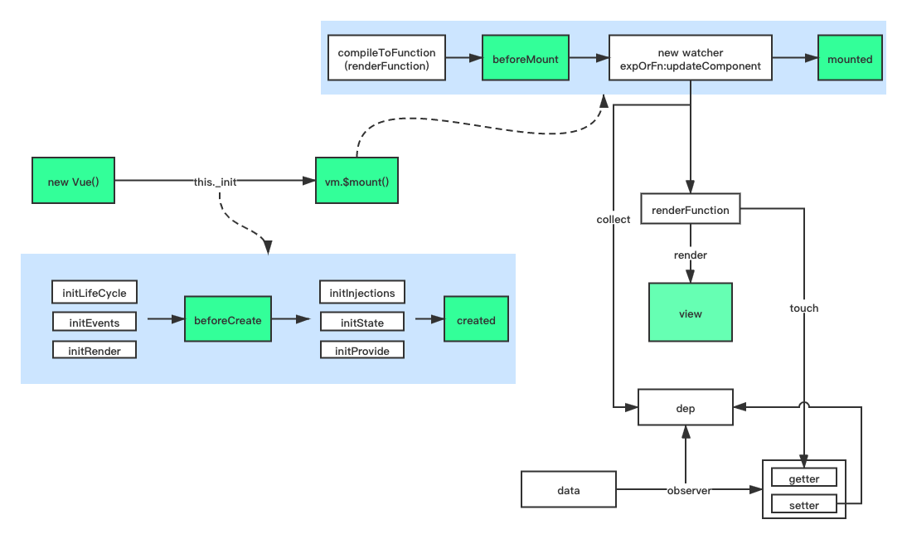

# 从源码看生命周期 LifeCycle

    Vue2 版本：2.6.11

### 1. 初始化阶段

- `new Vue()`时会执行构造函数中的`this._init()`，初始化生命周期`initLifecycle`相关参数、事件中心`initEvents`、渲染相关，然后执行生命周期钩子函数`beforeCreate`。

- 执行`initinjections`处理 injection，继续执行`initState`，对`props、methods、data、computed、watch`进行初始化，再执行`initProvide`，最后执行生命周期`created`。在`created`中，`new Vue()`时传入的相关数据、方法已经处理完成，可以在此时对数据进行操作。
- 此时，`this._init()`进入尾声，判断当前实例是否存在`el`，存在的话则调用`vm.$mount()`，进入下一阶段。

### 2. 模板编译阶段

**注意：运行版本中，已经将模板编译成了渲染函数，所以不存在这个阶段。**

首先判断该实例中是否存在渲染函数(`this.$options.render`)，如果不存在则将模板编译为渲染函数。这也是为什么`template`和`render`同时存在时，会执行 render 的原因。

执行生命周期钩子函数`beforeMount`，此时渲染函数已经生成，接下来进入挂载阶段。

### 3. 挂载阶段

挂载阶段的核心是通过`new Watcher`，将`updaeComponent`作为第二个参数传入，通过执行`updateComponent`对`render`所用到的参数进行依赖收集。

`updateComponent`的主要代码：

```
vm._update(vm._render(), hydrating)
```

`vm._render()`生成最新的 Vnode，`vm._update()`进行`patch`更新 DOM。

执行生命周期钩子函数`mounted`，进入运行阶段。

### 4. 运行阶段

在初始化阶段，`Vue`中定义的`data`经过`observe`变成了响应式数据，数据被 setter 时，就会触发`dep.notify()`通知到各个`watcher`，调用各个`watcher`中的`update()`进行更新。
让我们来看看数据更新的流程：

```
data -> setter -> dep.notify -> watcher.update -> view
```

事实上，触发`update()`后，会将当前`watcher`push 进一个更新队列，再在`nextTick`中，通过 id 对更新队列进行优先级排列，然后遍历执行`watcher.run()`，即最后的更新操作。在执行`watcher.run()`之前，会调用`beforeUpdate`生命周期函数，等待更新队列遍历完毕后，再依更新相反顺序执行`updated`生命周期函数。

话不多说，直接上图：


