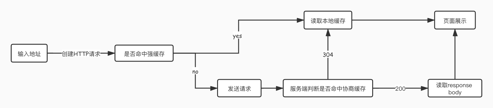

# 浏览器缓存策略
浏览器缓存可以有效减少网络开销，减轻服务器压力，加快页面响应速度，是提升性能的一种有效方式。  
浏览器根据http首部字段对http响应报文进行缓存，根据使用的http首部字段不同可以分为强缓存和协商缓存。
## 浏览器缓存使用的首部字段：
### 1. 通用首部字段

| 首部字段名  | 说明                |
| --------- | ----------------------- |
| Cache-Control | 控制缓存行为 |
### 2. 请求首部字段

| 首部字段名  | 说明                |
| --------- | ----------------------- |
| If-Match | 用于比较ETag是否一致 |
| If-None-Match | 用于比较ETag是否一致 |
| If-Modified-Since | 比较资源的更新时间，用于确认代理或客户端拥有的本地资源的有效性 |
### 3. 响应首部字段  

| 首部字段名  | 说明                |
| --------- | ----------------------- |
| Etag | 资源的匹配信息 |

### 4. 实体首部字段

| 首部字段名  | 说明                |
| --------- | ----------------------- |
| Expires | 实体主体过期的日期时间 |
| Last-Modified | 资源的最后修改日期时间 |

## 强缓存
命中强缓存后，浏览器将直接读取本地缓存，不会发送请求。
### Expires
## 协商缓存
未命中强缓存时，浏览器会发送请求，服务端通过对比http请求首部字段来判断是否命中协商缓存。命中后，浏览器将直接读取本地缓存。未命中协商缓存时，将从服务端加载资源。