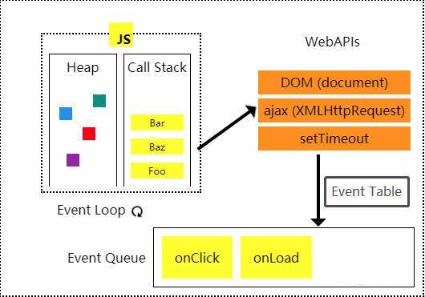

# Eventloop 浏览器事件循环机制

从需求开始。

## 为什么要了解Eventloop

先举个简单的栗子🌰。

```javascript
const validate = () => {
  const timeStamp = Date.now();
  setTimeout(() => console.log(Date.now() - timeStamp), 500);
}
validate();
```

上述的代码的运行结果是什么呢？是`500`吗？

事实上，当我们尝试多次运行validate函数，会发现，`setTimeout`的回调函数打印出来的结果并不是我们想象中的500，甚至不是一个固定的数值。

```
validate(); // 501
validate(); // 503
validate(); // 502
```

为什么定时器不如我们想象中的方式运作呢？

让我们带着疑问，来学习Eventloop吧。

当然，这并不是说我们学习Eventloop只是为了了解为什么定时器的时间不那么准确。

通过学习Eventloop，深入了解Js在浏览器中的运行机制，以方便我们在工作和学习中更加轻松的解决各种问题。

## 什么是Eventloop

我们都知道：**JS是一门单线程语言**。那么像`setTimeout`这样的异步代码究竟是如何运行的呢？

首先，我们从[HTML5 standard](https://html.spec.whatwg.org/multipage/webappapis.html#task-queue)中了解到：一个eventloop有一个或多个任务队列（Task queues），一个Task queue包含一组task。

值得注意的是，[HTML5 standard](https://html.spec.whatwg.org/multipage/webappapis.html#task-queue)特意提醒了我们：

> [Task queues](https://html.spec.whatwg.org/multipage/webappapis.html#task-queue) *are* [sets](https://infra.spec.whatwg.org/#ordered-set)*, not* [queues](https://infra.spec.whatwg.org/#queue)*, because* [step one of the event loop processing model](https://html.spec.whatwg.org/multipage/webappapis.html#step1) *grabs the first* [*runnable*](https://html.spec.whatwg.org/multipage/webappapis.html#concept-task-runnable) [task](https://html.spec.whatwg.org/multipage/webappapis.html#concept-task) *from the chosen queue, instead of* [dequeuing](https://infra.spec.whatwg.org/#queue-dequeue) *the first task.*

来看一张经典的eventloop运行图。



如图所示，task执行时会会将代码push进调用栈（Call Stack），执行完毕后，以后进先出的原则从调用栈中移除。调用栈中遇到异步API时，满足条件后将异步API的回调函数放入事件队列（Event Queue）中， 等待当前调用栈清空后，以先进先出的原则，执行事件队列中的回调函数，如此循环往复，就是**Eventloop**。

到这里，我们回到第一个问题，**为什么setTimeout定时器不如我们想象中准确呢？**

答案已经呼之欲出了：定时器设置的时间过后，`setTimeout`的回调函数放入事件队列后，等待调用栈执行的这段时间，造成了定时器执行的误差。

让我们更加深入一点，当Promise遇上

借用一下Jake Archibald的例子。

```javascript
console.log('script start');

setTimeout(() => {
  console.log('setTimeout');
}, 0);

Promise.resolve().then(() => {
  console.log('promise1');
}).then(function() {
  console.log('promise2');
});

console.log('script end');
```

上面这段代码的输出结果会是怎样的呢？

```javascript
script start
script end
promise1
promise2
setTimeout
```

咦，和想象中的结果不太一样对不对？

按照前文的描述，我们理想的结果应当是:

```js
script start
script end
setTimeout
promise1
promise2
```

为什么呢？

## 宏任务和微任务

不急，让我们先看看[HTML5 standard](https://html.spec.whatwg.org/multipage/webappapis.html#task-queue)中对**eventloop**的这样一段描述：

>Each [event loop](https://html.spec.whatwg.org/multipage/webappapis.html#event-loop) has a currently running task, which is either a [task](https://html.spec.whatwg.org/multipage/webappapis.html#concept-task) or null. Initially, this is null. It is used to handle reentrancy.
>
>Each [event loop](https://html.spec.whatwg.org/multipage/webappapis.html#event-loop) has a microtask queue, which is a [queue](https://infra.spec.whatwg.org/#queue) of [microtasks](https://html.spec.whatwg.org/multipage/webappapis.html#microtask), initially empty. A microtask is a colloquial way of referring to a [task](https://html.spec.whatwg.org/multipage/webappapis.html#concept-task) that was created via the [queue a microtask](https://html.spec.whatwg.org/multipage/webappapis.html#queue-a-microtask) algorithm.
>
>Each [event loop](https://html.spec.whatwg.org/multipage/webappapis.html#event-loop) has a performing a microtask checkpoint boolean, which is initially false. It is used to prevent reentrant invocation of the [perform a microtask checkpoint](https://html.spec.whatwg.org/multipage/webappapis.html#perform-a-microtask-checkpoint) algorithm.

通常，我们会将异步API分为**宏任务（macrotask）**和**微任务（microtask）**，也就是上述标准中的task和microtask。**微任务会先于宏任务执行，宏任务会触发一次完整的事件循环，而微任务不会。**

**常见的浏览器微任务/宏任务**

>**宏任务（macrotask）**：setTimeout、setInterval、I/O、UI 交互事件等。
>
>**微任务（microtask）**：Promise.then、 MutationObserver等。  

基于宏任务和微任务，让我们再完善一下对于**Eventloop**的描述：

1. task执行时会会将代码push进调用栈（Call Stack），执行完毕后，以后进先出的原则从调用栈中移除；
2. 调用栈中遇到异步API时，满足条件后，微任务及宏任务的回调函数分别进入相应的事件队列；
3. 等待当前调用栈清空后，依次执行微任务事件队列中的回调函数；
4. 当微任务事件队列及当前调用栈清空后，开始执行宏任务事件队列中的回调函数。如此循环往复，就是**Eventloop**。

这时，回到上文中`promise`和`setTimeout`的例子，我们来逐行解析一下：

1. 当前task执行，输出`script start`
2. setTimeout的callback被添加进macrotask队列中
3. 实例化`Promise`，`Promise.then`的callback被依次添加进microtask队列中
4. 输出`script end`
5. 当前task执行完毕，call stack为空，依次执行microtask队列中的callback，依次输出1，2
6. 执行下一个task，输出`setTimeout`
