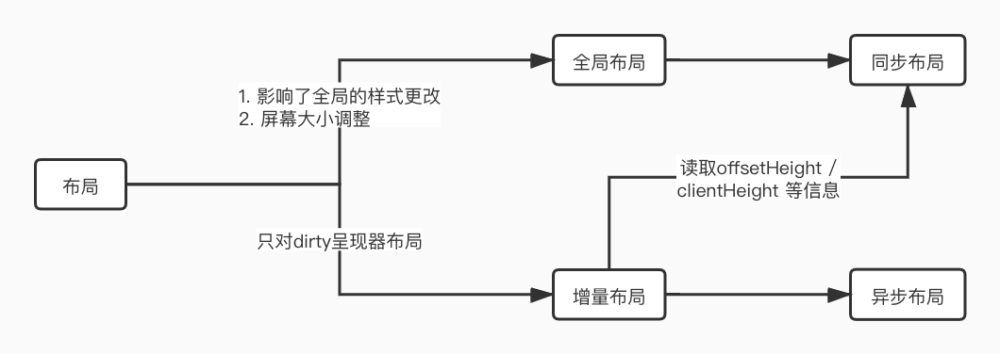

# 回流和重绘

什么是重绘和回流？重绘和回流是浏览器渲染过程中的一环，想要了解重绘和回流，首先需要了解浏览的渲染过程。

<!-- more -->

## 浏览器渲染

不同内核浏览器的渲染过程大同小异，以 WebKit 内核为例，浏览器的具体渲染过程如下图：

1. 分别解析 HTML 和 CSS，生成 DOM 树和 CSSOM 树；
2. 结合生成的 DOM 树和 CSSOM 树，构建呈现树，呈现树中的元素称为呈现器，此时的呈现器不包含位置和大小信息，；
3. 回流，又称布局或者重排，计算呈现树中节点的位置及大小信息。
4. 绘制，将呈现器的内容显示在屏幕上。

## 布局/回流/重排

呈现器在创建完成并添加到呈现树时，并不包含位置和大小信息。计算这些值的过程称为布局或重排。  
**触发布局的操作有：**

1. 全局样式的更改，如改变字体大小
2. 屏幕大小调整
3. 呈现器位置和大小的改变
4. 读取 offsetHeight/clientHeight 等信息

为避免对所有细小更改都进行整体布局，浏览器采用了一种“dirty 位”系统。如果某个呈现器发生了更改，或者将自身及其子代标注为“dirty”，则需要进行布局。  
因此，布局又可以分为全局布局和增量布局。同时布局的执行方式又可以分为异步执行和同步执行。

## 重绘

将呈现器中的内容呈现到屏幕上到过程就称为绘制。因此，呈现器中内容或样式到修改导致到重新绘制，又称为重绘。  
呈现器上几何信息的修改触发布局到改变到样式呈现在用户面前，必经之路就是绘制。除此之外，修改呈现器的 color、opacity 等不影响位置和大小信息的操作，也会触发绘制。  
一言概之就是：**回流一定会重绘，但重绘不一定会回流**。

## 优化

1. 尽量避免使用`display: table`及`<Table>`，布局过程中表格的计算需要经历不止一次的遍历
2. 尽量连续读取 offsetHeight 等信息
3. 尽量连续修改 DOM 样式，或直接修改 class
4. 使用`documnetFragment`进行 DOM 操作
5. GPU 加速，如使用`will-change`将元素提升至合成层。
