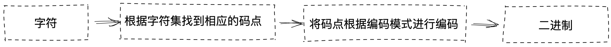
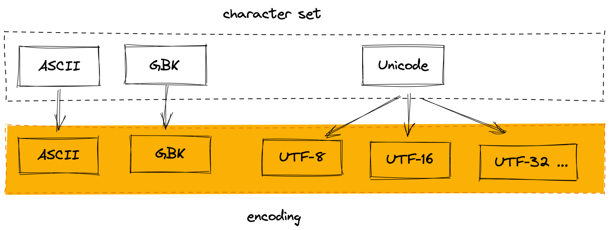

# 娣卞叆瀛楃闆嗕笌缂栫爜-深入字符集与编码

在浏览网页或文本时，有时会出现乱码的情况，大多数情况是因为编码不对，同一段文字，在不同编码下展示的结果不同：

```
// UTF-8
深入字符集与编码

// GBK
娣卞叆瀛楃闆嗕笌缂栫爜
```

比如为了确保网页的正常展示，通常会在`html`会使用`meta`标签作出声明：

```html
<meta charset="utf-8">
```

然而，`charset="utf-8"`并不如其字面意思是指定字符集（character set）为UTF-8。

UTF-8是一种编码(encoding)方法，不是字符集。上述html标签用于声明使用UTF-8进行编码，而UTF-8是unicode字符集编码方法之一。

## 字符集和编码

我们都知道，计算机是由许多二极管组成，数据以二进制的形式储存在计算机底层。这个存储的过程中，就涉及到了数据的编码。

先了解一下基础概念：

**字符集（character set）**，是各国家文字、标点符号、图形符号、数字的集合。字符集种类较多，每个字符集包含的字符个数不同，常见字符集有：ASCII字符集、GB2312字符集、BIG5字符集、 GB18030字符集、Unicode字符集等。字符集中包含了字符及其对应的代码值，这个代码值又称**码点（code point）**。

**编码（encoding）**，是计算机准确处理各种字符集文字，以便计算机能够识别和存储各种文字的方式。

字符集的存在更像是一本字典，我们根据某个字符查询到了对应的码点，然后将其用相应的编码方式编码为二进制数据。



## 字符集的发展史

### ASCII

计算机应用的初期，为了用同一种编码方法在各种不同的计算机设备之间传递数据，1967年出台了美国信息交换标准代码（American Standard Code for Information Interchange,ASCII）。这套编码规则一共规定了128个字符的编码，包含了拉丁字母和阿拉伯数字、英式标点符号、控制字符（回车、方向）。

由于出台的时间优势及其通用性，后期出现的字符集，基本都兼容了ASCII。

### GBK

虽然ASCII在英语字符标准化的道路上迈出了重要的一步，但它包含的字符编码有限，无法表达其他语言。

简而言之，它支持使用英语说“hello”，但不支持使用中文说“您好”。

为了解决这个问题，国内的规定了GB 类的汉字编码模式：ASCII 值小于 127 的字符的意义与原来 ASCII 集中的字符相同，但当两个 ASCII 值大于 127 的字符连在一起时，就表示一个简体中文的汉字，前面的一个字节（高字节）从 0xA1 拓展到 0xF7，后面一个字节（低字节）从 0xA1 到 0xFE。

同时，为了在解码时操作的统一，GB 类编码表中还也加入了数学符号、罗马希腊的字母、日文的假名等，连在 ASCII 里本来就有的数字、标点、字母都统一重新表示为了两个字节长的编码，这就是我们常说的 "全角" 字符，而原来在 127 号以下的那些就叫 "半角" 字符了，这种编码规则就是后来的 GB2312字符集。

中华文化博大精深，汉字总数高达8万之多，GB2312 字符集的码位无法满足需求，于是扩展出了新的GBK标准：只要第一个字节是大于 127 就固定表示这是一个汉字的开始，不管后面跟的是不是扩展字符集里的内容。GBK 包括了 GB2312 的所有内容，同时又增加了近 20000 个新的汉字（包括繁体字）和符号。

### Unicode

随着计算机的普及率不断上升，各国都出台了自己的编码标准，如西欧语言中的ISO 8859-1、俄罗斯的KOI-8、中国的GBK。对于任意给定的代码值，在不同的编码方案下有可能对应不同的字母，编码方案使用的编码长度也各不相同，这些不同的编码方案也为国际之间交流带来了一定的麻烦。1987年，Unicode编码方案应运而生，一统天下。它支持全球使用最广泛的语言、一些历史语言以及特殊符号，当然，它也兼容了ASCII字符集。

## 编码

许多情况下，字符集和编码被混为一谈，是因为大多数情况下，字符集与编码方式是一一对应的，比如ASCII，就只有一种编码方式，区分字符集和编码没有意义；相反的，unicode有多种编码方法，指定unicode，仅仅只是指定了字符的码点，我们的计算机还是不懂该用何种方式来进行编码成0和1。

显然，字符集与编码是一一对应或者一对多的关系，只要指定了编码，则指定了所用字符集。




那么为何unicode有UTF-8、UTF-16、UTF-32等多种编码方式呢？

> UTF是"Unicode/UCS Transformation Format"的首字母缩写，即把Unicode字符转换为某种格式之意。

在区分一段二进制为一个字符还是多个字符的时候，最简单的办法是直接规定多少字节代表一个字符。

ucs-2、utf-32就是使用这种方式。然而，正如中文有8万多个汉字，实际使用的却只有三千多个，如果每个字符都使用定长的方式编码，需要占用很大的空间，编码效率会下降。于是出现了不定长的编码方式，遵循一定的规则使用不同的字节长度存储不同码点的字符。

### [UTF-16](https://datatracker.ietf.org/doc/html/rfc2781)

Utf-16是使用2或4个字节来进行编码的。

Js是使用ucs-2进行编码的，而ucs-2是utf-8的前身。

```js
console.log('烤🌰'.length); // 3
```

吖！烤🌰的长度为什么是3！让我们慢慢来看。

ucs-2最初设计为使用2个字节，即16个bit，一共可以包含65536个字符，渐渐的人们发现6万多个字符不够用，于是对新增的字符使用4个字节，扩展成为了现在的utf-16。

**编码规则：**

| Unicode 码点范围              | UTF-16 编码规则                                              | UTF-16编码                             |
| ----------------------------- | ------------------------------------------------------------ | -------------------------------------- |
| U+0000 - U+D7FU+E000 - U+FFFF | 使用双字节编码，其中U+D800～U+DFFF作为保留码点，不映射字符，辅助编码。 | `xxxxxxxxxx xxxxxxxxxx`                |
| U+10000 - U+10FFFF            | 1 .码点减去65536后对应的二进制补足20位 <br>2. 将这20位二进制从中分割为上10位值和下10位值 <br>3. 将上值和0xD800相加得到高位，下值和0xDFFF相加得到低位 | `110110xxx xxxxxxxx 110111yy yyyyyyyy` |

**举个🌰:**

1. `🌰`在unicode中的码点为U+1F330，0x1F330 - 65536 = 62456，转为二进制`1111001100110000`
2. 补足20位后：`0000111100 1100110000`，上值：`0000111100`（十进制 60），下值：`1100110000`（十进制 186)
3. 分别与高低位相加，得到高位：60 + 0xD800 = 55356（十六进制d83c），底位：186 + 0xDC00 = 57136（十六进制df30）
4. 转为二进制，就得到了utf-8编码后的二进制数据啦：`11011000 00111100 11011111 00110000`

而在[es规范](https://262.ecma-international.org/5.1/#sec-8.4)中指明，当对字符串进行操作时，会将一个utf-16码点为一个元素：

>When a String contains actual textual data, each element is considered to be a single UTF-16 code unit. Whether or not this is the actual storage format of a String, the characters within a String are numbered by their initial code unit element position as though they were represented using UTF-16. 

显然，🌰包含两个utf-16码点，所以有：`'烤🌰'.length === true`

我们在js中转义一下🌰的码点，是否能直接打印出来？

```js
'\u1f330' // 'ἳ0'
```

这是什么东东！前面说到，js实际上是使用的utf-16的前身ucs-2进行编码的，因此，超出U+0000 - U+FFFF码点范围的部分，转义失败了。当我们将高低位拼接起来进行转义：

```js
'\ud83c\udf30' // 🌰
```

转义成功啦！

🤔事实上，es6为了解决这个问题也提供了相应的兼容：

可以使用`{}`将码点包围起来就可以准确无误的转义啦：

```js
'\u{1f330}' // 🌰
```

而对于包含🌰这类ucs-2编码方案之后新增字符的字符串，可以通过扩展运算符、或者for...of对其进行操作：

```js
[...🌰].length // 2

for(let i of '烤🌰') {
  console.log(i);
}
// 烤
// 🌰
```

### [UTF-8](https://datatracker.ietf.org/doc/html/rfc3629)

utf-8是目前使用范围最广的编码模式。

>  UTF-8就是为了解决向后兼容ASCII码而设计，Unicode中前128个字符，使用与ASCII码相同的二进制值的单个[字节](https://zh.wikipedia.org/wiki/字节)进行编码，而且字面与ASCII码的字面一一对应，这使得原来处理ASCII字符的[软件](https://zh.wikipedia.org/wiki/軟體)无须或只须做少部分修改，即可继续使用。因此，它逐渐成为[电子邮件](https://zh.wikipedia.org/wiki/電子郵件)、[网页](https://zh.wikipedia.org/wiki/網頁)及其他[存储](https://zh.wikipedia.org/wiki/儲存裝置)或发送文字优先采用的编码方式。

**编码规则：**

1. 单字节字符：字节的第一位为`0`，后面7位为字符的 Unicode 码
2. `n`字节字符（`n > 1`）：第一个字节的前`n`位都设为`1`，第`n + 1`位设为`0`，后面字节的前两位设为`10`。剩下的二进制位，均为这个字符的 Unicode 码

显然，对于ASCII包含的字符，其编码模式与ASCII一致。

> UTF-8使用一至六个[字节](https://zh.wikipedia.org/wiki/位元组)为每个字符编码（尽管如此，2003年11月UTF-8被RFC 3629重新规范，只能使用原来Unicode定义的区域，U+0000到U+10FFFF，也就是说最多四个字节）

| Unicode 码点范围   | 字节数 | UTF-8 编码                           |
| ------------------ | ------ | ------------------------------------ |
| U+0000 - U+007F    | 1      | `0xxxxxxx`                           |
| U+0080 - U+07FF    | 2      | `110xxxxx 10xxxxxx`                  |
| U+10800 - U+FFFF   | 3      | `1110xxxx 10xxxxxx 10xxxxxx`         |
| U+10000 - U+1FFFFF | 4      | `11110xx 10xxxxxx 10xxxxxx 10xxxxxx` |

**举个🌰：**

1. `🌰`在unicode中的码点为U+1F330，处于U+10000 - U+1FFFFF码点范围中，需要使用四个字节进行编码，其编码格式为：`11110xx 10xxxxxx 10xxxxxx 10xxxxxx`
2. 0x1F330转二进制为：`11111001100110000`，从后向前补入`11110xx 10xxxxxx 10xxxxxx 10xxxxxx`，就得到了utf-8编码后的二进制数据啦：`11110000 10011111 10001100 10110000`


