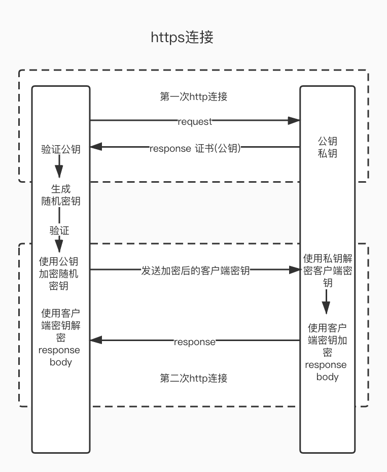
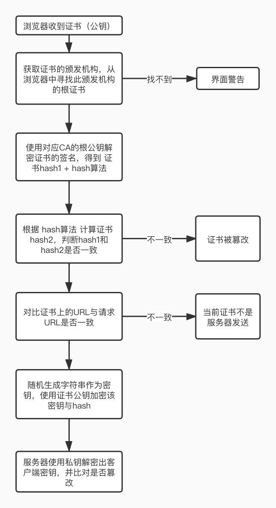

## 请求方法

| 方法  | 特点 |
| --------- | ----------------------- |
| GET | 幂等 |
| POST | 非幂等 |
| PUT | 幂等，向指定位置上传最新内容 |
| HEAD | 类似POST，但服务器不返回body，仅返回header |
| TRACE | 回显服务器收到的请求，用于debug |
| OPTIONS | 访问接口支持的所有http请求方法 |
| DELETE | 删除文件 |
| CONNECT | 用于SSL加密的服务器链接，协议提升 |

## 通用头
| 名称  | 含义 |
| --------- | ----------------------- |
| Date | 消息发送时间 |
| Cache-Control | 控制缓存相关 |
| Transfer-Encoding | 表示消息主体的编码格式 |
| Connection | 是否需要持久连接 |
| Upgrade | 要求服务升级到高版本协议 |

## 请求头
| 名称  | 含义 |
| --------- | ----------------------- |
| Authorization | 身份认证数据 
| If-Modfied-Since | |
| If-Match   | |
| If-None-Match    | |
| Range    | 请求部分资源，指定资源范围 |
| Referer    | 通过点击超级链接进入下一个页面时，在这里记录上一个页面的URI |

## 响应头
| 名称  | 含义 |
| --------- | ----------------------- |
| Location | 信息的准确位置。当前请求URI为相对路径时，该字段用来返回绝对路径 |
| Accept-Ranges| 当希望仅请求部分数据（使用Range指定），服务器会告知客户端是否支持 |

## 实体头
| 名称  | 含义 |
| --------- | ----------------------- |
| Expires | body的有效期 |
| Last-Modified | |
| Etag | 资源的唯一标识 |
| Content-Type    | body的数据类型 |
| Content-Length    | body的长度 |
| Content-Range    | 仅请求部分数据时，表示body包含的数据范围 |
| Allow    | 指定URI支持的方法 |
## 响应码
### 1xx 信息
| 名称  | 含义 |
| --------- | ----------------------- |
| 100 | 服务器仅接收到部分请求，客户端应到继续发送 |
| 101 | 服务器转换协议，用于websocket的转换 |
| 103 | 用于PUT或POST请求回复失败时的回复请求建议 |

### 2xx 成功
| 名称  | 含义 |
| --------- | ----------------------- |
| 200 | success |
| 201 | 请求被创建完成(PUT) |
| 202 | 请求已被接受，但处理未完成 |
| 203 | 请求已被成功处理，但是一些响应头可能不正确，因为使用的所其他文档的拷贝 |
| 204 | 浏览器应当继续显示原来的文档 |
| 205 | 刷新页面，用于清除表单输入内容 |
| 206 | 带range的get已完成 |

### 3xx 重定向
| 名称  | 含义 |
| --------- | ----------------------- |
| 300 | 多重选择，用户可以多选重定向地址，最多5个 |
| 301 | 所请求但页面已移至新但URL，永久重定向 |
| 302 | 实际实现：POST重定向为GET |
| 304 | 缓存 |
| 305 | 应当通过Location所指定的代理服务器读取 |
| 306 | 已废弃，更换代理 |
| 307 | 临时重定向 |
| 308 | 永久重定向 |

### 4xx 客户端错误
| 名称  | 含义 |
| --------- | ----------------------- |
| 400 | 烂请求 |
| 401 | 需要认证 |
| 403 | 权限不足 |
| 404 | 找不到资源 |
| 405 | 方法不被允许 |
| 406 | 无法解析返回数据格式 |
| 408 | 超出服务端等待时间 |
| 414 | URL太长 |
### 5xx 服务端错误
| 名称  | 含义 |
| --------- | ----------------------- |
| 500 | 无法预计的服务器错误 |
| 501 | 服务器不支持所请求的功能 |
| 502 | 网关错误，上游返回错误 |
| 503 | 服务不可用 |
| 504 | 网关超时 |
| 505 | HTTP协议版本不支持 |
| 511 | 用户需要提供身份验证来获取网络访问入口 |

## 版本
### 1.1
增加了keep-alive
### 2.0
1. 头部信息压缩
2. 多路复用，多个请求复用一条TCP连接
3. 服务器推送
### 3.0
QUIC 基于UDP实现

## https

https数据传输过程中，使用SSL/TLS对数据进行加密，使用http对加密后的数据进行传输。所以:  
> https = http + SSL/TLS。

SSL全称为Secure Socket Layer，即安全套接层协议，是为网络通信提供安全及数据完整性的一种安全协议。

TLS全称为Transfer Layer Security，安全传输层协议，是SSL3.0的后续版本。

### 对称加密
对称加密又称为公钥加密。即信息的发送方和接收方使用同一个密钥去进行信息的加密或解密。  
加密：明文 + 公钥 + 加密算法 => 密文  
解密：密文 + 公钥 + 解密算法 => 明文  

### 非对称加密
非对称加密又称为私钥加密。  
加密：明文 + 公钥 + 加密算法 => 密文  
解密：密文 + 私钥 + 解密算法 => 明文  

### https流程

### 证书验证流程

浏览器第一次http连接后从服务端收到证书，即公钥，并尝试寻找根证书，找到后，使用根公钥揭秘证书签名得到一个hash值A和一个hash算法，同时根据这个hash算法计算出hash值B，判断AB是否相等，如果相等，则继续验证证书URL与请求URL是否一致，一致则生成随机密钥，并用证书公钥加密随机密钥，发送给服务端，此时进行的是第二次http连接。

## Question
1. http报文如何分割header和body？
2. 常用的请求头？
3. 常用的响应码？
4. GET与POST的区别？
5. 304是什么情况下使用的？
6. http和https的区别？
7. 详述一下https的流程？
8. 如何验证证书？