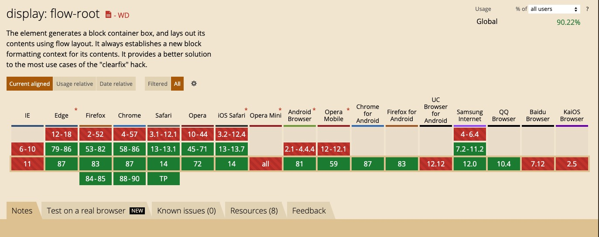

总结一些常见css问题。
<!-- more -->
## CSS盒模型
盒模型分为：标准盒模型`box-sizing: content-box;`和怪异盒模型(IE)`box-sizing: border-box`。
区别：
- 标准盒模型的宽高 = 内容宽高
- 怪异盒模型的宽高 = 内容宽高 + padding + border

## offsetHeight/offsetWidth、clientHeight/clientWidth
- offsetHeight、offsetWidth包含了border、padding、content
- clientHeight、clientWidth包含了padding、content

## BFC 块级格式上下文
块格式化上下文（Block Formatting Context，BFC） 是Web页面的可视CSS渲染的一部分，**是一个独立的渲染区域**。这个区域内部元素不受外部影响，反之亦然。

创建BFC的方式有： 
- `display: flow-root`。 使用[flow-root](https://drafts.csswg.org/css-display/#valdef-display-flow-root)总是为其内容创建一个新的块级格式上下文。相较其他方式，无副作用，兼容较差。

- 其他方式，有副作用：
  - 根元素`<html>`
  - `float: 不为none`
  - `display: inline-block/table-cell/table-caption/table/table-row/table-row-group/table-header-group/table-footer-group/inline-table/flex/inline-flex/grid/inline-grid`
  - `overflow: 不为visible`
  - `contain: layout/content/paint`
  - `column-span: all`
  - `column-count: 不为auto`或`column-width: 不为auto`

BFC的特性：
- 同一个BFC下子元素的margin会发生重叠
- BFC不会与浮动元素重叠
- 计算BFC高度时，包含浮动元素的高度

应用：
- 自适应两栏布局
- 清除浮动

## 伪类和伪元素
- 伪类：选择器的一种，用于选择处于特定状态的元素，如`:hover`、`:nth-child(n)`、`:nth-of-type(n)`
- 伪元素：创建一些不在文档树中的元素，并为其提添样式，如`::first-line`、`::before`，一个选择器中只能使用一个伪元素，伪元素必须紧跟在语句中的简单选择器/基础选择器之后

## 一栏固定，一栏自适应布局

1. `float` + BFC
利用**BFC不会与浮动元素重叠**的特性
```html
<style>
.left {
  float: left;
  width: 300px;
  height: 100%;
  background: pink;
}
.right {
  display: flow-root;
  height: 100%;
  background: purple;
}
</style>
<div>
  <div class="left"></div>
  <div class="right"></div>
</div>
```

2. `flex`
```html
<style>
.container {
  display: flex;
  height: 100%;
}
.left {
  width: 300px;
  height: 100%;
  background: pink;
}
.right {
  height: 100%;
  background: purple;
  flex: 1;
}
</style>
<div class="container">
  <div class="left"></div>
  <div class="right"></div>
</div>
```

3. `table-cell`
`table-layout: fixed`表示列宽由表格宽度和列宽度设定
```html
<style>
.container {
  display: table;
  table-layout: fixed;
  width: 100%;
  height: 100%;
}
.left {
  width: 300px;
  background: pink;
  display: table-cell;
}
.right {
  background: purple;
  display: table-cell
}
</style>
<div class="container">
  <div class="left"></div>
  <div class="right"></div>
</div>
```

4. `position` + `margin`
```html
<style>
.container {
  width: 100%;
  height: 100%;
}

.left {
  position: absolute;
  width: 100px;
  height: 100%;
  background: pink;
}

.right {
  margin-left: 100px;
  height: 100%;
  background: purple;
}
</style>
<div class="container">
  <div class="left"></div>
  <div class="right"></div>
</div>
```

## 水平居中
1. 行内元素：`text-align: center`
2. 宽度确定的块级元素
  - `margin: 0 auto`
  - `margin: -width/2`
3. 宽度未知的块级元素
  - `display: flex; justify-content: center;`
  - `display: inline-block; text-align: center;`

## 垂直居中
- 行内元素： `vertical-align: middle`
- 设置`line-height`
- `display: flex; align-items: center`
- 父级`display: flex;`，子级`margin: auto`

## 一些自检小问题🤔
1. 实现一个垂直居中的`div`，左右距窗口边界`10px`，高度始终为宽度的一半，并解释一下原理
2. 伪类和伪元素的区别，你常用的伪类和伪元素有哪些？
3. 如何选中`div`下的第n个`<p>`标签(`div`下不止有`<p>`标签)