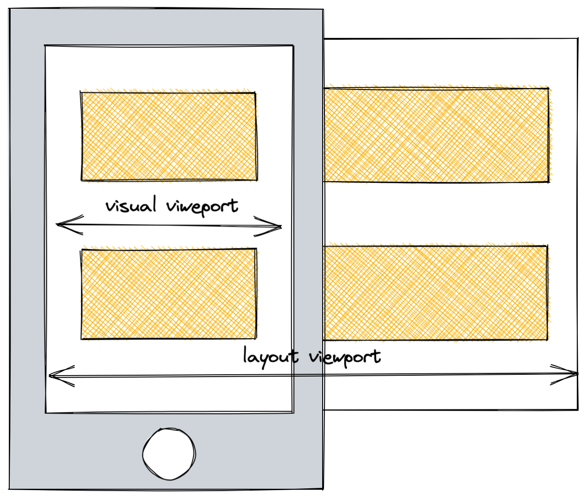
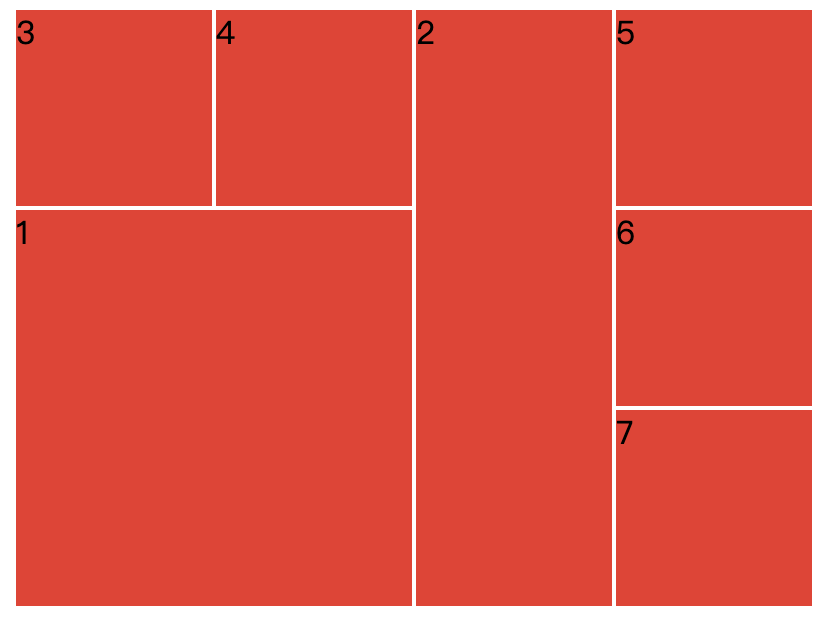

# 响应式布局总结

## 响应式设计

随着人们使用的屏幕尺寸的种类越来越多，出现了响应式网页设计的概念（*responsive web design，RWD*）。响应式布局设计，是指将桌面设备上的网页内容在移动设备上进行优化排版，使用户能够在移动设备上更方便地阅读并操作。

响应式与自适应非常相似：


最直观的感受是自适应需要在窗口的缩放完成后，才对界面的大小进行适应，因此有一个闪动的过程，而响应式则是流畅丝滑的。这种不同体现在我们的代码中则是：自适应通常需要借助js来判断窗口大小的变换并对此做出响应（如rem自适应布局），而响应式则借助媒体查询、flex布局等方式实现一个液态的网页，避免闪动的过程。

**响应式布局并不是一种单一的技术，而是一种概念**。现代布局方式，例如flex布局和grid布局默认是响应式的。它们都假设你在尽力创建一个可伸缩的、液态的网格，而且给了你更容易这样做的方式。

## 相关基础

### viewport

视窗（viewport)是`<html>`的容器，决定了页面布局的基础大小。

PC端的浏览器中，`viewport`严格等于窗口的宽高。移动端由于屏幕大小的受限，引入了`visual viewport`和`layout viewport`两个概念。


通常在进行多端页面开发时会通过`<meta>`标签，将`layout viewport`显式的设置为设备宽度。

```html
<meta name="viewport" content="width=device-width, initial-scale=1.0">
```

其他相关参数：

- `initial-scale`：设定了页面的初始缩放，我们设定为1。
- `height`：特别为视口设定一个高度。
- `minimum-scale`：设定最小缩放级别。
- `maximum-scale`：设定最大缩放级别。
- `user-scalable`：如果设为`no`的话阻止缩放。

### css

#### 1. 媒体查询

[媒体查询](https://developer.mozilla.org/zh-CN/docs/Web/CSS/Media_Queries/Using_media_queries)是css3特性之一，可以根据各种设备特征和参数的值或者是否存在等来为网站或应用提供不同的样式，是响应式布局的基础。  

每条媒体查询语句都由一个可选的媒体类型和任意数量的媒体特性表达式构成。可以使用多种逻辑操作符合并多条媒体查询语句。

**媒体类型**

```css
@media all {...} // 所有设备
@media print {...} // 打印预览模式
@media screen {...} // 屏幕
@media speech {...} // 语音合成器
```

在响应式布局中，通常使用`@media screen`配合逻辑操作符，为不同视口大小提供样式：

```css
.container {
  background-color: purple;
}
// 视口宽度小于1224px时，container的背景色为粉色
@media screen and (max-width: 1224px) {
  .container {
    background-color: pink;
  }
}
```

#### 2. 常用相对单位：

通过相对单位，配合媒体查询，实现响应式元素。

- 百分比

% 通常是相对于其父元素的相对单位，不同css属性下，相对基准不同。

| css属性             | 相对基准                                                     |
| ------------------- | ------------------------------------------------------------ |
| `height`、`width`   | `height`：相对于父元素的`height` ， `width`：相对于父元素的`width` |
| `padding`、`margin` | 相对于父元素的`width`                                        |
| `top`、`bottom`     | 相对于`position`值不为`static`的父元素`height`               |
| `left`、`right`     | 相对于`position`值不为`static`的父元素`width`                |
| `border-radius`     | 想对于自身的`width`                                          |

- 视口单位 vw/vh/vmin/vmax

相较于 % 是基于父级或自身的宽高大小，视口单位则是基于当前视口大小，与html层级无关。

| 视口单位 |                                        |
| -------- | -------------------------------------- |
| `vw`     | 相对于视窗的宽度，1`vw` = 视口宽度的1% |
| `vh`     | 相对于视窗的高度，1`vh` = 视口高度的1% |
| `vmin`   | `vw`和`vh`中的较小值                   |
| `vmax`   | `vw`和`vh`中的较大值                   |

- rem

`rem`是相对于根元素`<html>`的字体大小的单位。根元素的`font-size`相当于一个全局基准，满足`1rem = 根元素font-size `。

```css
html {
  font-size: 16px;
}

.box {
  height: 1.5rem; // 24px
  width: 2rem; // 32px
}
```

#### 3. flex布局

flex布局，也就是"弹性布局"，用于为盒状模型提供最大的灵活性，可以简便、完整、响应式地实现各种页面布局。在[2020css报告](https://2020.stateofcss.com/en-US/report/)中，对flex布局进行实践的受访者人数最多，是目前最流行的布局属性。  

flex的使用非常简单，为父元素设置`display: flex;`后，子元素自动成为flex容器的成员。成员可设置的属性中与宽高自适应相关的属性主要是以下三个：

- `flex-shrink`: 定义元素缩小比例
- `flex-grow`: 定义元素放大比例
- `flex-basis`: 定义元素占据主轴的空间，即元素缩放的基础大小

要实现成员水平平均分布，则可以添加以下样式：

```css
.container {
  display: flex;
}
.member {
  flex: 1;
}

/*
  flex: 1等价于：
  flex-grow: 1;
  flex-shrink: 1;
  flex-basis: 0%;
*/

```

#### 4. grid布局

对父元素设置`display: grid`即可启用grid布局。

相较于flex针对main-axis和cross-axis的一维布局形式，grid布局通过行和列，将容器内部划分为单元格的形式，是目前唯一具备二维布局特性的css属性。

实现以下效果，使用其他布局可能需要对html嵌套多层，而`grid`可以轻松做到：



在线预览地址：[grid布局](https://codepen.io/hellottxo/pen/jOwrpvx)

```html
<div class="cube">
  <div class="rect rect-1">1</div>
  <div class="rect rect-2">2</div>
  <div class="rect">3</div>
  <div class="rect">4</div>
  <div class="rect">5</div>
  <div class="rect">6</div>
  <div class="rect">7</div>
</div>
```

```css
.cube {
  display: grid;
  grid-template-columns: repeat(4, 100px);
  grid-template-rows: repeat(4, 100px);
}

.rect {
  background-color: #ef342a;
  border: 1px solid #fff;

}

.rect-1 {
  grid-column-start: 1;
  grid-column-end: 3;
  grid-row-start: 2;
  grid-row-end: 4;
}

.rect-2 {
  grid-row-start: 1;
  grid-row-end: 4;
}
```

遗憾的是，[grid布局的兼容性](https://caniuse.com/?search=display%3A%20grid)较差，使用时需要结合需求谨慎使用，或者配合`@support`进行兼容处理。


## 常见场景

结合知乎上有人提出的[响应式界面基本准则](https://www.zhihu.com/question/20976405/answer/158684822)，我们来实现一下常见场景：

### 1. 可伸缩的内容区块

内容区块的在一定程度上能够自动调整，以确保填满整个页面。
在线预览：[codeOpen地址](https://codepen.io/hellottxo/pen/BaZKWRv)

```html
<div class="container">
  <div class="box"></div>
  <div class="box"></div>
  <div class="box"></div>
  <div class="box"></div>
  <div class="box"></div>
  <div class="box"></div>
</div>
```

```css
.container {
  width: 100%;
  height: 100%;
  background: #b8f7d3;
  display: flex;
  border: 40px solid #ae63e4;
  padding: 10px;
  box-sizing: border-box;
  flex-wrap: wrap;
}
// 固定margin 为20px，内容区块弹性伸缩
.box {
  width: calc(33.3% - 20px);
  height: calc(50% - 20px);
  background: #56bcf9;
  margin: 10px;
  box-sizing: border-box;
}
```

通常情况下，页面`div`的嵌套并不止有box一层，为box添加`width: 33.3%`，在box的子元素中设置`margin`，避免使用`calc()`会更加高效。

### 2. 可自由排布的内容区块 + 适应页面尺寸的边距  + 能自动折叠的导航和菜单

- 当页面尺寸变动较大时，能够减少/增加排布的列数；
- 页面尺寸发生更大变化时，区块的边距也应该变化；
- 导航的状态，展开还是收起，应该根据页面尺寸来判断

我们来实现一个常见的布局：
在线预览地址：[codeOpen地址](https://codepen.io/hellottxo/pen/mdwEXEa)

```html
<div class="layout-container">
  <div class="menu">
    <div class="menu-item">menu1</div>
    <div class="menu-item">menu2</div>
    <div class="menu-item">menu3</div>
  </div>
  <div class="content">
    <div class="box"></div>
    <div class="box"></div>
    <div class="box"></div>
    <div class="box"></div>
    <div class="box"></div>
    <div class="box"></div>
  </div>
</div>
```

```css
.layout-container {
  display: flex;
  box-sizing: border-box;
  width: 100%;
  height: 100%;
}

.menu {
  flex-shrink: 0;
  width: 300px;
  background: #409EFF;
}

.menu-item {
  padding: 1rem;
}

.content {
  flex: 1;
  display: flex;
  flex-wrap: wrap;
  overflow: auto;
  background: pink;
}

.box {
  width: calc(33.3% - 4rem);
  height: 300px;
  background: #56bcf9;
  margin: 2rem;
  box-sizing: border-box;
}

@media screen and (max-width: 800px) {
  .layout-container {
    flex-direction: column;
  }
  .menu {
    display: flex;
    align-items: center;
    justify-content: center;
    width: 100%;
    height: 60px;
  }
  .box {
    width: calc(50% - 2rem);
    height: 100px;
    margin: 1rem;
  }
}

```

### 3.  能够适应比例变化的图片

- 充满父容器、维持原有的图片比例

```css
.img {
  width: 100%;
  height: auto;
}
```

- 充满父容器

```css
.img {
  width: 100%;
  height: 100%;
}
```

- 使用[`<picture>`](https://developer.mozilla.org/zh-CN/docs/Web/HTML/Element/picture)为不同媒体类型、特性提供不同的图片

```html
<picture>
    // 窗口宽度大于800px时，展示large.jpg
    <source srcset="./large.jpg" media="(min-width: 800px)">
    // 否则，展示small.jpg
    
</picture>
```

使用object-fit调整填充的形式：

```css
.img {
  object-fit: cover;
}
```

- 使用`background: url()`配合媒体查询，为不同媒体类型、特性提供不同的图片

```css
.img {
  width: 100%;
  background: url(./small.jpg);
  backgroud-size: cover;
}
@media screen and (min-width: 800px) {
  .img {
    background: url(./large.jpg);
  }
}
```

- 使用视口单位，随窗口大小成比例缩放

```css
.img {
  // (图片宽度 300px) / (设计稿视口宽度 1440px) = 0.2083
  width: 20.8vw;
  height: auto;
}
```

### 4. 能够自动隐藏/部分显示的内容

为文字设置文本溢出，或通过媒体查询，隐藏部分文字。

```css
// 单行文本溢出
.text-ellipsis {
  overflow: hidden;
  text-overflow: ellipsis;
  white-space: nowrap;
}

// 多行文本溢出
.text-ellipsis--multiple {
  overflow:hidden;
  text-overflow:ellipsis;
  display:-webkit-box;
  -webkit-line-clamp:2;
  -webkit-box-orient:vertical;
}
```

## 响应式布局核心思想

1. 使用媒体查询，为不同大小的视口提供多套样式。
2. 除了设计稿明确要求固定大小的容器，尽量使用`width: 100%`或`flex: 1`等自动撑满父级宽高的形式定义布局容器，确保布局容器是弹性的、液态的。
3. 适当的为页面设置`min-width`、`min-height`，确保最小适配宽高。
4. 在确认视觉效果的前提下，为图片的响应、文字的大小、文本溢出作相应的处理。
5. 使用其他资源，也应尽量保证其响应性。如Echarts，通过`MutationObserver`对视口或菜单的大小进行监听，及时`resize`。

**响应式布局并不是一套固定的公式，实现形式多种多样，不同实现方式有它各自的优缺点（如灵活性、兼容性、性能），需要我们在书写的时候结合需求综合考虑。**

## 布局新特性`@container`

chrome正在实验的`@container`使我们能够根据父容器的大小对元素进行样式设置。

与`@media`使用形式与作用相似，但比起对整个视口对宽高进行查询，`@container`作用的是某个元素。

使用：

```css
// 为父元素设置contain
.card {
  contain: size layout;
}

// card的宽度小于800px时，激活以下样式
@container (max-width: 800px) {
  .links {
    display: none;
  }

  /* ... */
}
```

体验地址: [@container体验](https://codepen.io/una/pen/RwodQZw)

注意需要下载chrome canary版本并在实验性功能处开启：Enable CSS Container Queries。

## 参考文档

1. [AWD vs. RWD](https://skyrocket.is/articles/adaptive-vs-responsive-web-design-awd-vs-rwd)
2. [9 basic principles of responsive web design](https://blog.froont.com/9-basic-principles-of-responsive-web-design/)
3. [MDN-媒体查询](https://developer.mozilla.org/zh-CN/docs/Web/CSS/Media_Queries)
4. [MDN-响应式设计](https://developer.mozilla.org/zh-CN/docs/Learn/CSS/CSS_layout/Responsive_Design)
5. [new-responsive](https://web.dev/new-responsive/)
6. [2020css报告](https://2020.stateofcss.com/en-US/report/)

