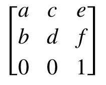
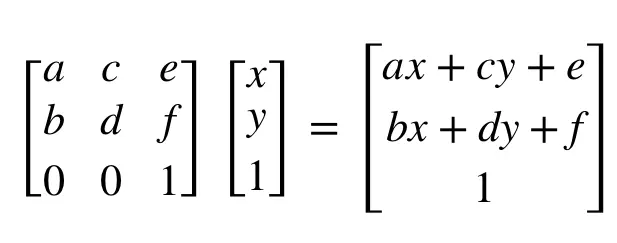
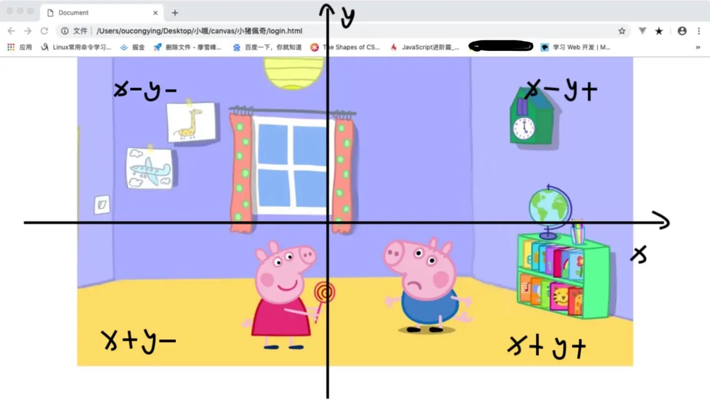

某个月黑风高的夜晚，前端小白菜收到一个任务：做一张像王者荣耀登录界面一样的图片。  
<!-- more -->
让我们先上效果图，当当当： 


是不是看起来很简单？其实，真的，很简单！  

接下来，是手摸手教学时间！:100:

## 摆放图片
首先，我们先来一张背景图片，再放上两只猪，html和css代码：  
```css
<style>
  body {
    margin: 0;
  }
  .container {
    position: relative;
    width: 1080px;
    height: 600px;
    background: url(back.png) 100% no-repeat;
    margin: 0 auto;
  }
  img {
    height: 300px;
    position: absolute;
    bottom: 0;
  }
  .pig1 {
    right: 300px;
  }
  .pig2 {
    left: 300px;
  }
</style>

<body>
  <div class="container">
    <div class="pig1">
      
    </div>
    <div class="pig2">
      
    </div>
  </div>
</body>  
```
接下来的任务，就是让这两只猪随着我们的~~猪蹄~~鼠标轻轻点击动起来。  

## 获取鼠标移动的坐标
根据我们想要得到的图片与鼠标之间的交互效果，为了方便计算，以图片的中心为原点，建立一个坐标轴。 那么以这个坐标轴为基准，计算鼠标在图片上滑过时的坐标js为：

```js
  $('.container').mousemove(function () {
    //以图片中心为原点，鼠标的横纵坐标：mousex,mousey
    let mousex = event.clientX - $('.container').offset().left - $('.container').width() / 2;
    let mousey = event.clientY - $('.container').offset().top - $('.container').height() / 2;
    })
```

说到这里，我们还是没有让小猪动起来呀...不要着急，我们先来了解一下css中的transform属性。

W3C中是这样子介绍滴:
>transform 属性向元素应用 2D 或 3D 转换。该属性允许我们对元素进行旋转、缩放、移动或倾斜。

其中，我们需要应用的语法有：

值| 描述
---|---
rotateX(angle) |定义沿着 X 轴的 3D 旋转。
rotateY(angle)| 定义沿着 Y 轴的 3D 旋转。
perspective(n)|	为 3D 转换元素定义透视视图。
matrix(a,b,c,d,e,f)|定义 2D 转换，使用六个值的矩阵。

以上面的小猪仔们为例，假设小猪仔图片的中心点坐标为（x,y）。  
**已知**：`transform`的旋转默认是围绕着小猪仔们的中心点坐标（x,y）  
**问**：如何通过`transform:matrix(a,b,c,d,e,f)`中六个参数我们可以对小猪仔进行2D转换？  
**解**：  
**matrix**，顾名思义，这个2D转换与矩阵有着不可言说的关系。 `transform:matrix(a,b,c,d,e,f)`中六个参数相对应的矩阵为：  


相应的，这六个参数对(o,o)坐标的影响计算公式为：  


经过2D转换后中心点的横纵坐标为：

```js
x = ax+cy+e
y = bx+dy+f
```

那么到底怎么用呢？  
**举个栗子**，我们想让小猪水平往左挪5px，再垂直往上挪2px，设置  
```css
transform:matrix(1,0,0,1,5,2)
```

因此,当我们需要利用`transform:matrix(a,b,c,d,e,f)`对小猪进行平面位置上对偏移操作时，只要记住：  

```css
transform:matrix(a,b,c,d,水平偏移值,垂直偏移值)
```

当然，`matrix(a,b,c,d,e,f)`这个看上去==很大一坨很牛逼==的东西可不止这个小小的用法哟，`rotateX()`和`rotateY()`都可以用`matrix(a,b,c,d,e,f)`实现。有兴趣的小朋友们可以自己去研究一下哟～

## 背景图随鼠标移动倾斜
根据我们想得到的交互效果，在之前建立的坐标轴中，`rotateX()` `rotateY()`值的正负如下：

让我们火速写好css和js：
```js
  let mousex,mousey,changex,changey;
  let mv = 500;
  $('.container').mousemove(function () {
    //相对图片中心为坐标轴，鼠标移动的位置
    mousex = event.clientX - $('.container').offset().left - $('.container').width() / 2;
    mousey = event.clientY - $('.container').offset().top - $('.container').height() / 2;
    
    changex = mousey / mv;
    changey = mousex / mv;

    //根据鼠标移动的相对坐标进行背景图片翻转
    $('.container').css('transform', 'perspective(400px) rotatex(' + changex + 'deg) rotateY(' + changey + 'deg)')
    
    //根据鼠标移动的对相对坐标调整两只猪对距离
    $('.pig2').css('transform', 'matrix(1,0,0,1,' + mousex / -30 + ',' + mousey / -30 + ')')
    $('.pig1').css('transform', 'matrix(1,0,0,1,' + mousex / 20 + ',' + mousey / 20 + ')')
    })
    
    $('.container').mouseout(function () {
      $('.container').css('transform', 'perspective(400px) rotatex(0deg) rotateY(0deg)')
      $('.pig2').css('transform', 'matrix(1,0,0,1,0,0)')
      $('.pig1').css('transform', 'matrix(1,0,0,1,0,0)')
  })
```  

好啦，现在一个有鼠标交互效果的图片已经做好啦～  