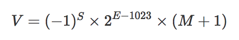

# 小数精度丢失的原因

计算机由晶体管组成，所以内部数据的存储和运算都采用二进制，而我们在实际生活工作中，使用的是十进制。  
因此，对于计算机在运算时产生的精度问题，本质上是使用二进制模拟十进制进行运算产生的精度问题。

## Js中的数字储存
> 根据 ECMAScript 标准，JavaScript 中只有一种数字类型：基于 IEEE 754 标准的双精度 64 位二进制格式的值。


如图所示，64位可分为三部分：  
1. 符号为S：0代表正数，1代表负数
2. 阶码位E：在机器中表示一个浮点数时需要给出指数，这个指数用整数形式表示，这个整数叫做阶码，阶码指明了小数点在数据中的位置。
3. 小数位M：超出部分自动进1舍0

IEEE 754 标准规定的二进制表现为：


为什么`E-1023`，`M+1`呢？

计算机中实际储存数字时，遵循科学计数法（如上图所示），且整数位为1。
- `E-1023`  
科学计数法中的指数位是允许为负的，计算机底层只可以进行加法运算，因此引入偏移量表示负数，约定阶码减去1023，[0,1022]表示为负，[1024,2047]表示为正。
- `M+1`  
整数位固定为1，所以储存时舍去。M的固定长度加上被省略的整数位为53，因此有`Number.MAX_SAFE_INTEGER === Math.pow(2, 53) - 1`,而非`Number.MAX_SAFE_INTEGER === Math.pow(2, 52) - 1`。

## 0.1 + 0.2 !== 0.3
小数位超出52时会自动进1舍0，加上隐含的整数位，Js中小数位的长度为：
```js
Math.pow(2, 53).toString().length // 16
```
0.1转换为二进制为：`0.00011...0011`，0.2转换为二进制为`0.0011...0011`，0.1 + 0.2为`0.010011...0011`，使用整数为1，科学计数法的形式(不考虑偏移量表现形式)表示为`1.00110011...0011x2^-2`，此时`00110011...0011`第53位为`1`，进1舍0，小数部位的值位`00110011...0011010`，转换为十进制后为`0.30000000000000004`，所以：`0.1 + 0.2 !== 0.3`。

## Number.prototype.toFixed()

[MDN](https://developer.mozilla.org/zh-CN/docs/Web/JavaScript/Reference/Global_Objects/Number/toFixed)中对`toFixed()`的描述： 
> 一个数值的字符串表现形式，不使用指数记数法，而是在小数点后有 digits（注：digits具体值取决于传入参数）位数字。该数值在必要时进行四舍五入，另外在必要时会用 0 来填充小数部分，以便小数部分有指定的位数。 如果数值大于 1e+21，该方法会简单调用 Number.prototype.toString()并返回一个指数记数法格式的字符串。  
描述中提到：
> 该数值在必要时进行四舍五入  
我们来测试一下：
```js
const num = 1.245;
num.toFixed(1); // '1.2'
num.toFixed(2); // '1.25'
```
**为什么`num.toFixed(4)`的值为`0.1523`，而不是`0.1524`呢？**
我们来看一下[v8源码](https://github.com/v8/v8/blob/4b9b23521e6fd42373ebbcb20ebe03bf445494f9/src/fixed-dtoa.cc#L242)中对小数位操作的一段：
```cpp
// The given fractionals number represents a fixed-point number with binary
// point at bit (-exponent).
// Preconditions:
//   -128 <= exponent <= 0.
//   0 <= fractionals * 2^exponent < 1
//   The buffer holds the result.
// The function will round its result. During the rounding-process digits not
// generated by this function might be updated, and the decimal-point variable
// might be updated. If this function generates the digits 99 and the buffer
// already contained "199" (thus yielding a buffer of "19999") then a
// rounding-up will change the contents of the buffer to "20000".
static void FillFractionals(uint64_t fractionals, int exponent,
                            int fractional_count, Vector<char> buffer,
                            int* length, int* decimal_point) {
  DCHECK(-128 <= exponent && exponent <= 0);
  // 'fractionals' is a fixed-point number, with binary point at bit
  // (-exponent). Inside the function the non-converted remainder of fractionals
  // is a fixed-point number, with binary point at bit 'point'.
  if (-exponent <= 64) {
    // One 64 bit number is sufficient.
    DCHECK_EQ(fractionals >> 56, 0);
    int point = -exponent;
    // 将前[fractional]位小数转成字符串
    for (int i = 0; i < fractional_count; ++i) {
      if (fractionals == 0) break;
      // Instead of multiplying by 10 we multiply by 5 and adjust the point
      // location. This way the fractionals variable will not overflow.
      // Invariant at the beginning of the loop: fractionals < 2^point.
      // Initially we have: point <= 64 and fractionals < 2^56
      // After each iteration the point is decremented by one.
      // Note that 5^3 = 125 < 128 = 2^7.
      // Therefore three iterations of this loop will not overflow fractionals
      // (even without the subtraction at the end of the loop body). At this
      // time point will satisfy point <= 61 and therefore fractionals < 2^point
      // and any further multiplication of fractionals by 5 will not overflow.
      fractionals *= 5;
      point--;
      int digit = static_cast<int>(fractionals >> point);
      buffer[*length] = '0' + digit;
      (*length)++;
      fractionals -= static_cast<uint64_t>(digit) << point;
    }
    // [fractionals + 1]位进1舍0
    // If the first bit after the point is set we have to round up.
    if (point > 0 && ((fractionals >> (point - 1)) & 1) == 1) {
      DtoaRoundUp(buffer, length, decimal_point);
    }
  } else {  // We need 128 bits.
    DCHECK(64 < -exponent && -exponent <= 128);
    UInt128 fractionals128 = UInt128(fractionals, 0);
    fractionals128.Shift(-exponent - 64);
    int point = 128;
    for (int i = 0; i < fractional_count; ++i) {
      if (fractionals128.IsZero()) break;
      // As before: instead of multiplying by 10 we multiply by 5 and adjust the
      // point location.
      // This multiplication will not overflow for the same reasons as before.
      fractionals128.Multiply(5);
      point--;
      int digit = fractionals128.DivModPowerOf2(point);
      buffer[*length] = '0' + digit;
      (*length)++;
    }
    if (fractionals128.BitAt(point - 1) == 1) {
      DtoaRoundUp(buffer, length, decimal_point);
    }
  }
}
```
实际上，`toFixed(n)`会先计算出相应的二进制保留位数f，将前f位二进制小数转换成字符串，再查看f+1位数值，进1取0。
因此，`toFixed(n)`的结果在**必要时**才会进行四舍五入。