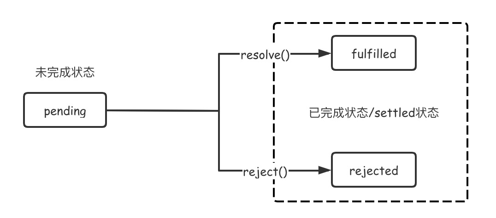

# 手写Promise
> Promise是异步编程的一种解决方案。
ES6将其纳入规范，提供了内置的Promise对象。  
Promise 对象是异步操作的最终结果的占位符。它表示了一个暂未获得，但在未来即将获得的结果值。  
因此，一个Promise对象有三种状态：
1. pending: 未完成状态，此时异步操作正在执行。
2. fulfilled: 完成状态，操作成功。
3. rejected: 完成状态，操作失败。

```js
class myPromise {
    constructor(executor) {
        this.state = 'pending';
        this.value = null;
        this.reason = null;
        const resolve = () => {};
        const reject = () => {};
    }
}
```
