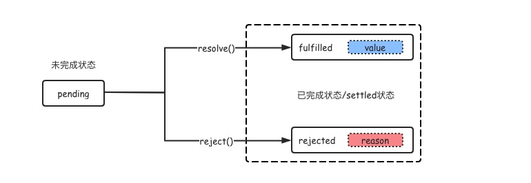

# 手写 Promise

Promise 是异步编程的一种解决方案。 ES6 将其纳入规范，提供了内置的 Promise 对象。Promise 对象是异步操作的最终结果的占位符。它表示了一个暂未获得，但在未来即将获得的结果值。

<!-- more -->

## Promise 状态

Promise 对象接受一个带有`resolve`和`reject`参数的函数，函数内部操作执行完毕后会调用`resolve`或`reject`函数将状态由 pending 转变为 fulfilled 或 rejected。
一个 Promise 对象一定处于以下三种状态之一：

1. pending: 未完成状态，此时异步操作正在执行，即将过渡到完成状态。
2. fulfilled: 完成状态，操作成功，一定有一个结果值，状态不可再变化。
3. rejected: 完成状态，操作失败，一定有一个原型，状态不可再变化。
   

```js
class Promise {
  constructor(executor) {
    this.state = "pending";
    this.result = undefined;
    const self = this;
    const resolve = function (value) {
      if (self.state === "pending") {
        self.state = "fulfilled";
        self.result = value;
      }
    };
    const reject = function (reason) {
      if (self.state === "pending") {
        self.state = "rejected";
        self.result = reason;
      }
    };
    try {
      executor(resolve, reject);
    } catch (err) {
      reject(err);
    }
  }
}
```

## then()

一个 Promise 对象提供`then`方法来访问其现在或最终的结果(或失败的原因)。

```js
promise.then(onFulfilled, onRejected);
```

### `then`方法接受两个函数作为参数，这两个参数是操作成功/失败时的回调函数。

- `onFulfilled`函数在 promise 状态变为 fulfilled 时调用，`onFulfilled`接受 promise 的最终结果作为参数。如果`onFulfilled`不是函数，会被包装为`(x) => x`。

- `onRejected`函数在 promise 状态变为 rejected 时调用，`onRejected`接受 promise 的拒绝原因作为参数。如果`onRejected`不是函数，则会被替换为`Thrower`函数。

```js
class Promise {
    constructor(executor) {
        ...
        this.resolveCallBacks = [];
        this.rejectCallBacks = [];
      	const self = this;
        const resolve = function(value) {
            if (self.state === 'pending') {
                self.state = 'fulfilled';
                self.result = value;
                self.resolveCallBacks.forEach((fn) => fn());
            }
        };
        const reject = function(reason) {
            if (self.state === 'pending') {
                self.state = 'rejected';
                self.result = reason;
                self.rejectCallBacks.forEach((fn) => fn());
            }
        };
    }
    function then(onFulfilled, onRejected) {
        if (this.state === 'fulfilled') {
            onFulfilled(this.value);
        }
        if (this.state === 'rejected') {
            onRejected(this.reason);
        }
        if (this.state === 'pending') {
            this.resolveCallBacks.push(() => {
                onFulfilled(this.value);
            });
            this.rejectCallBacks.push(() => {
                onRejected(this.reason);
            });
        }
    }
}
```

### `then`方法返回一个新的 promise 对象。

```js
promise2 = promise1.then(onFulfilled, onRejected);
```

- `onFulfilled`返回一个结果值`x`/undefined，新的 promise 对象状态将会变成 fulfilled，并且将该结果值作为新的 promise 对象`onFulfilled`的参数。
- `onFulfilled`或`onRejected`抛出一个错误，新的 promise 对象状态将会变成 rejected，并且将抛出的错误作为新的 promise 对象`onRejected`的参数。
- 返回一个 fulfilled 状态的 promise，`promise2`也是 fulfilled 状态，并接受`promise1`的`onFulfilled`回调函数参数值作为`onFulfilled`回调函数的参数。
- 返回一个 rejected 状态的 promise，`promise2`也是 rejected 状态，并接受`promise1`的`onRejected`回调函数参数值作为`onRejected`回调函数的参数。  
  [Promise / A+](https://promisesaplus.com/)规范中提供了 Promise 相互嵌套的操作的过程，依照规范，继续完善我们的 promise。

```js
class Promise {
    constructor(executor) {
        ...
    }
    function resolvePromise (promise, x, resolve, reject) {
        // 如果promise和x是同一个对象，则发生了循环调用，调用reject函数，并抛出一个TypeError
        if (promise === x) {
            return reject(new TypeError('Chaining cycle detected for promise'));
        }
        // 确保多次调用时，只有第一次生效
        if (['object', 'function'].includes(typeof x) && x !== null) {
            try {
                let then = x.then;
                // 如果then为function，则以x为context执行then
                if (typeof then === 'function') {
                    then.call(x, (f) => {
                        // 继续解析
                        this.resolvePromise(promise, f, resolve, reject);
                    }, (r) => {
                        reject(r);
                    })
                } else {
                    // 如果then不为function，执行resolve()
                    resolve(x);
                }
            } catch(err) {
                reject(err);
            }
        }else {
            // x 既不是object，也不是fucntion时，执行resolve()
            resolve(x);
        }
    }
    function then(onFulfilled, onRejected) {
        const promise2 = new Promise((resolve, reject) => {
            if (this.state === 'fulfilled') {
                const x = onFulfilled(this.value);
                this.resolvePromise(promise2, x, resolve, reject);
            }
            if (this.state === 'rejected') {
                const x = onRejected(this.reason);
                this.resolvePromise(promise2, x, resolve, reject);
            }
            if (this.state === 'pending') {
                this.resolveCallBacks.push(() => {
                    const x = onFulfilled(this.value);
                    this.resolvePromise(promise2, x, resolve, reject);
                });
                this.rejectCallBacks.push(() => {
                    const x = onRejected(this.reason);
                    this.resolvePromise(promise2, x, resolve, reject);
                });
            }
        });
        return promise2;
    }
}
```

## catch()

> `catch()`方法返回一个 Promise，并且处理拒绝的情况。

```js
class Promise {
    ...
    catch = (onRejected) => this.then(undefined, onRejected);
}
```

## Promise.all()

> `Promise.all(iterable)`方法返回一个 promise 实例，`iterable`内所有的 promise 都 resolve，或不包含 promise 对象时，该 promise 实例 resolve，以`iterable`内所有返回值为数组作为 value；任一个 promise reject 时，该实例 reject，以第一个失败的 promise reason 作为 reson。

```js
class Promise {
  static all = (list) => {
    return Promise((resolve, reject) => {
      const values = [];
      let resolveNum = 0;
      list.forEach((item, i) => {
        if (item && typeof item.then === "function") {
          item.then((res) => {
            values[i] = res;
            resolveNum++;
            if (resolveNum === list.length - 1) {
              resolve(values);
            }
          }, reject);
        } else {
          values[i] = item;
          resolveNum++;
          if (resolveNum === list.length - 1) {
            resolve(values);
          }
        }
      });
    });
  };
}
```

## 总结

Promise 就像一个装着程序的箱子，我们不需要关注程序在箱子内运行的过程，程序完成或失败后总会自动打开告知我们执行的结果。同时，为了方便内部程序井然有序的运行，Promise 定义了三种箱子的状态：初始、完成、失败。`then`方法的链式调用，就像大箱子套小箱子。而通过这三种状态，完成箱子内部逻辑的自洽，满足箱子之间的相互嵌套。

完整的 promise 实现代码如下：

```js
class MyPromise {
  constructor(excutor) {
    this.state = "pending";
    this.result = undefined;
    this.resolveCallbacks = [];
    this.rejectCallbacks = [];
    const self = this;
    const resolve = function (value) {
      if (self.state === "pending") {
        self.state = "fullfilled";
        self.result = value;
        setTimeout(self.resolveCallbacks.forEach((fn) => fn()));
      }
    };
    const reject = function (value) {
      if (self.state === "pending") {
        self.state = "rejected";
        self.result = value;
        setTimeout(self.rejectCallbacks.forEach((fn) => fn()));
      }
    };
    try {
      excutor(resolve, reject);
    } catch (err) {
      reject(err);
    }
  }

  resolvePromise(promise, x, resolve, reject) {
    if (promise === x) {
      reject(new TypeError("chaning cycle detected for promise!"));
    }
    if (["object", "function"].includes(typeof x) && x !== null) {
      try {
        let then = x.then;
        if (typeof then === "function") {
          then.call(
            x,
            (f) => {
              this.resolvePromise(promise, f, resolve, reject);
            },
            (r) => {
              reject(r);
            }
          );
        } else {
          resolve(x);
        }
      } catch (err) {
        reject(err);
      }
    } else {
      resolve(x);
    }
  }

  then(onFullfilled, onRejected) {
    const promise2 = new MyPromise((resolve, reject) => {
      if (this.state === "pending") {
        this.resolveCallbacks.push(() => {
          const x = onFullfilled(this.result);
          this.resolvePromise(promise2, x, resolve, reject);
        });
        this.rejectCallbacks.push(() => {
          const x = onFullfilled(this.result);
          this.resolvePromise(promise2, x, resolve, reject);
        });
      }
      if (this.state === "fullfilled") {
        const x = onFullfilled(this.result);
        this.resolvePromise(promise2, x, resolve, reject);
      }
      if (this.state === "rejected") {
        const x = onRejected(this.result);
        this.resolvePromise(promise2, x, resolve, reject);
      }
    });
    return promise2;
  }

  catch(onRejectd) {
    this.then(undefined, onRejectd);
  }

  static all(arrs) {
    return new MyPromise((resolve, reject) => {
      const arr = [];
      let resolveNum = 0;
      arrs.forEach((fn, i) => {
        if (fn && typeof fn.then === "function") {
          fn.then((res) => {
            arr[i] = res;
            resolveNum++;
            if (resolveNum === arr.length - 1) {
              resolve(arr);
              return;
            }
          }, reject);
        } else {
          arr[i] = fn;
          resolveNum++;
          if (resolveNum === arr.length - 1) {
            resolve(arr);
            return;
          }
        }
      });
    });
  }
}
```

## 来一个小问题

实现一个批量请求函数 multiRequest(urls, maxNum)，要求如下：

- 要求最大并发数 maxNum
- 每当有一个请求返回，就留下一个空位，可以增加新的请求
- 所有请求完成后，结果按照 urls 里面的顺序依次打出

```js
function requestLimit(urls, limit) {
  return new Promise((resolve, reject) => {
    const rs = [];
    let count = 0;
    let total = urls.length;
    let resolveNum = 0;
    function handler() {
      let current = count++;
      if (count >= total) return;
      urls[current]().then((res) => {
        rs[current] = res;
        resolveNum++;
        handler();
        if (resolveNum === total) resolve(rs);
      });
    }
    while (count < limit) {
      handler();
    }
  });
}
```
