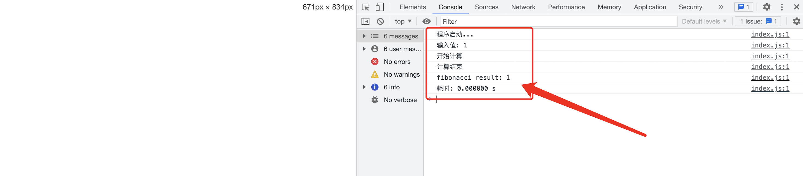

# WebAssembly初探-web端的视频、图片处理

WebAssembly的出现为在web端的视频、图片处理提供了无限可能。

## 什么是WebAssembly?
众所周知，Assembly为汇编，顾名思义，WebAssembly（以下简称wasm）可以理解为在web上的汇编语言。
关于wasm，mdn上有如下定义：
> WebAssembly 是一种新的编码方式，可以在现代的网络浏览器中运行 － 它是一种低级的类汇编语言，具有紧凑的二进制格式，可以接近原生的性能运行，并为诸如 C / C++等其他语言提供一个编译目标，以便它们可以在 Web 上运行。

wasm的出现并不是为了替代js，而是被设计为与 JS 互为补充并能协作，为其他语言与js之前架设桥梁，使得C/C++/Rust等其他语言可以在web端运行。


## WebAssembly性能
那么wasm的计算性能到底如何呢，让我们不考虑读取wasm及wasm与浏览器进行数据交互的前提下简单测试一下。

### 2.1. 编写C++测试代码
```c
#include <stdio.h>
#include <time.h>

int fibonnaci(int n);

int main(int argc, char ** argv) {
  int result;
  clock_t start_t, end_t;
  double diff_t;

  printf("程序启动...\n");
  int n = 40;
  printf("输入值: %d\n", n);
  start_t = clock();
  printf("开始计算\n");

  result = fibonnaci(n);
  end_t = clock();
  printf("计算结束\n");
  diff_t = (double)(end_t - start_t)/CLOCKS_PER_SEC;
  printf("fibonacci result: %d\n", result);
  printf("耗时: %f s\n", diff_t);
}

int fibonnaci(int n)
{
    if (n == 0) 
        return 0;
    if (n < 3) // 基本情况
        return 1;
    return fibonnaci(n - 1) + fibonnaci(n - 2);
}
```
### 2.2. 编译C++为wasm
编译教程已经很多了可以参考：[Compiling a New C/C++ Module to WebAssembly](https://developer.mozilla.org/en-US/docs/WebAssembly/C_to_wasm)

下载emsdk，用于编译：
```shell
# Get the emsdk repo
git clone https://github.com/emscripten-core/emsdk.git

# Enter that directory
cd emsdk

# Fetch the latest version of the emsdk (not needed the first time you clone)
git pull

# Download and install the latest SDK tools.
./emsdk install latest

# Make the "latest" SDK "active" for the current user. (writes .emscripten file)
./emsdk activate latest

# Activate PATH and other environment variables in the current terminal
source ./emsdk_env.sh

```

使用默认模板编译：
```
emcc index.html -o fibonacci.c

```

由于.wasm文件存在跨域的情况，我们使用http-server本地起一个静态服务：
```
http-server -a 127.0.0.1 -p 8090
```

得到如下效果：


为了确保其他变量一致，删去标准模板中的多余部分，准备一份编译html模板：
```
<!doctype html>
<html lang="en-us">
  <head>
    <meta charset="utf-8">
    <meta http-equiv="Content-Type" content="text/html; charset=utf-8">
    <title>Emscripten-Generated Code</title>
  </head>
  <body>
    <script type='text/javascript'>
      // Module是一个全局Js对象，提供一些api配置项，wasm代码初始化时会自动加载
      // 可以自己提供Module的实现来控制代码的执行
      var Module = {
        preRun: [],
        postRun: [],
        totalDependencies: 0,
      };
    </script>
    {{{ SCRIPT }}}
  </body>
</html>
```

执行编译命令：
```shell
emcc -o index.html fibonacci.c -O3 -s WASM=1 --shell-file template.html
```
得到了：


### 2.3. 编写js测试代码
```html
<!DOCTYPE html>
<html lang="en">
<head>
    <meta charset="UTF-8">
    <meta http-equiv="X-UA-Compatible" content="IE=edge">
    <meta name="viewport" content="width=device-width, initial-scale=1.0">
    <title>Document</title>
</head>
<body>
    <script>
      function fibonnaci(n) {
        if (n === 0) return 0;
        if (n < 3) return 1;
        return fibonnaci(n - 1) + fibonnaci(n - 2);
      }
      console.log('程序启动...')
      const n = 40;
      console.log(`输入值: ${n}`)
      const start = Date.now();
      console.log(`开始计算`);
      const result = fibonnaci(n);
      const end = Date.now();
      console.log(`计算结束`);
      console.log(`fibonacci result: ${result}`);
      console.log(`耗时: ${(end - start) / 1000}s`)

    </script>
    
</body>
</html>
```


### 2.4. 对比结果
改变fibonnaci输入值，并打开网页，得到如下对比结果：
> 注意：输入值为48时，斐波那契计算结果init溢出，会出现与js计算结果不一致的情况，因为本次为耗时对比，故对比结果不受影响

| 输入值 | wasm | js |
| ------ | ------ | ------ |
| 40 | 0.341s | 0.588s |
| 42 | 0.342s | 1.542s |
| 44 | 2.294s | 3.938s |
| 46 | 6.010s | 10.332s |
| 48 | 14.802s | 27.492s |
| 50 | 41.245s  | 79.452s |

wasm通常用于需要高性能的计算密集型应用程序，显然，随着计算的复杂程度线性增加，wasm性能优势愈加明显。

## wasm调试
Chrome的开发者工具目前对wasm调试的支持有限，对C/C++编译的wasm，chrome提供了插件[C/C++ DevTools Support](https://chrome.google.com/webstore/detail/cc%20%20-devtools-support-dwa/pdcpmagijalfljmkmjngeonclgbbannb)，使开发人员能够调试 C++ 应用程序。

我们将上述fibonacci.c修改一下，当n大于5时抛出错误。

```c
#include <stdio.h>
#include <time.h>
#include <errno.h>

int fibonnaci(int n);

int main(int argc, char ** argv) {
  int result;
  clock_t start_t, end_t;
  double diff_t;

  printf("程序启动...\n");
  int n = 40;
  printf("输入值: %d\n", n);
  start_t = clock();
  printf("开始计算\n");

  result = fibonnaci(n);
  end_t = clock();
  printf("计算结束\n");
  diff_t = (double)(end_t - start_t)/CLOCKS_PER_SEC;
  printf("fibonacci result: %d\n", result);
  printf("耗时: %f s\n", diff_t);
}

int fibonnaci(int n)
{
    if (n > 5) 
      perror("抛出一个错误");
    if (n == 0) 
        return 0;
    if (n < 3) // 基本情况
        return 1;
    return fibonnaci(n - 1) + fibonnaci(n - 2);
}
```
同时在编译时加入 `-g` 参数，告诉 Emscripten 在编译时为代码注入 DWARF 调试信息。

```
emcc -g fibonacci.c -o index.html
```

同样的我们起个静态服务打开页面，并在调试工具中打开支持DWARF实验特性


重新加载调试工具


打开异常捕获暂停选项并刷新页面,顺着断点的调用栈我们找到fibonacci.c

铛铛铛！我们已经顺利的在页面中看到c的代码。


## WebAssembly 实践
wasm的初衷并不是让我们用c来写web，而是让我们更方便更直接的复用其他语言成熟的框架。

### 1. opencv + wasm 猫脸识别
```js
const imgElement = document.querySelector('#input');
const textureElement = document.createElement('img');
textureElement.src = './assets/hat.png';

function init() {
  document.querySelector('input').addEventListener('change', (e) => {
    imgElement.src = URL.createObjectURL(e.target.files[0]);
  });
  document.querySelector('.upload').addEventListener('click', () => {
    document.querySelector('input').click();
  })
  document.querySelector('.ware').addEventListener('click', () => {
    detectFace();
  })
}

/**
 * 调整至指定宽高
 * @param {*} src 
 * @param {*} scale 缩放比例 
 */
function resize(src, x, y) {
  const smallMat = new cv.Mat();
  const dsize = new cv.Size(x, y);
  cv.resize(src, smallMat, dsize, 0, 0, cv.INTER_AREA)
  return smallMat
}

/**
 * 猫脸检测
 */
function detectFace() {
  // 图片读取
  const texture = cv.imread(textureElement);
  const src = cv.imread(imgElement);
  const gray = new cv.Mat();
  // 转灰度
  cv.cvtColor(src, gray, cv.COLOR_BGR2GRAY, );
  const faceCascade = new cv.CascadeClassifier();
  // 读取模型
  faceCascade.load('face.xml');
  const faces = new cv.RectVector();
  faceCascade.detectMultiScale(gray, faces);
  for (let index = 0; index < faces.size(); ++index) {
    const item = faces.get(index);
    const dst = resize(texture, item.width / 3, item.height / 3);
    for (let i = 0; i < dst.rows; i++) {
      for (let j = 0; j < dst.cols; j++) {
        setHat(src, dst, i, j, item)
      }
    }
  }
  cv.imshow('output', src);
  src.delete();
  faceCascade.delete();
  faces.delete();
}

/**
 * 给小猫戴帽子
 */
const setHat = (src, dst, i, j, item) => {
  const {
    x,
    y,
    width
  } = item;
  const srcPixi = src.ucharPtr(i + y * 0.8, j + x + 3 * width / 8);
  const texturePixi = dst.ucharPtr(i, j);
  if (checkIsTransparent(texturePixi)) return;
  for (let index = 0; index < 4; index++) {
    // 给每个像素点设值
    srcPixi[index] = texturePixi[index];
  }
}

// 帽子透明区域不赋值
const checkIsTransparent = (texturePixi) => texturePixi[0] === 0 && texturePixi[1] === 0 && texturePixi[2] === 0 && texturePixi[3] === 0;

const Module = {
  // 加载.wasm文件
  locateFile: function (name) {
    const files = {
      'opencv_js.wasm': './opencv_js.wasm'
    };
    return files[name];
  },
  // 加载猫咪训练数据
  preRun: [
    () => {
      Module.FS_createPreloadedFile(
        '/',
        'face.xml',
        'assets/haarcascade_frontalcatface.xml',
        true,
        false
      );
    }
  ],
  postRun: [init]
};
```

### 2. imagemagick + wasm psd素材翻译


