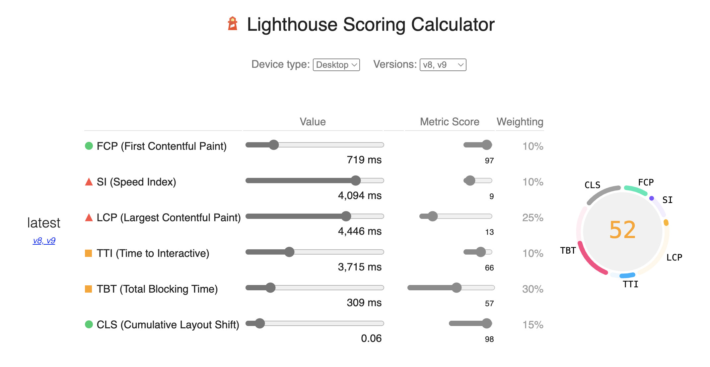
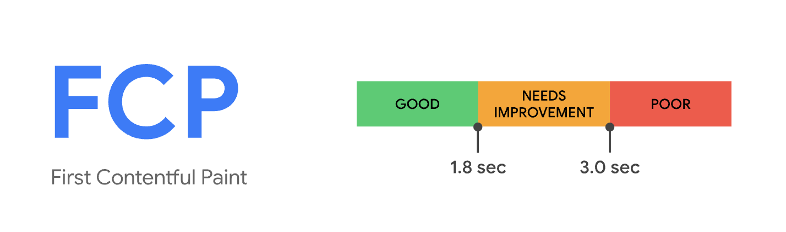
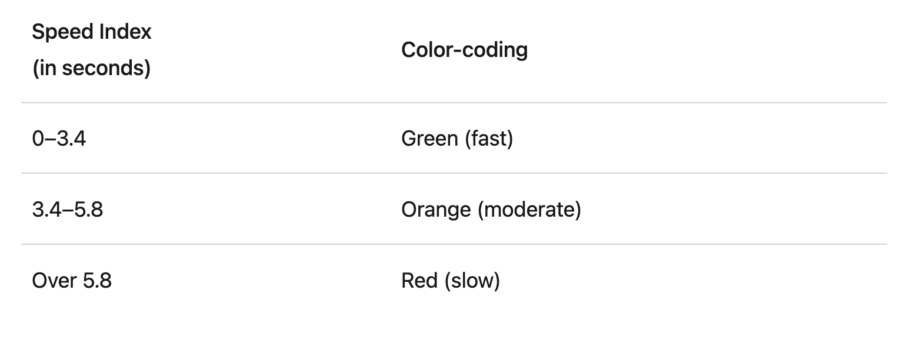
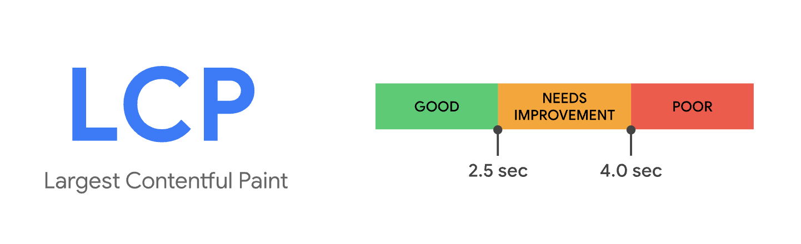
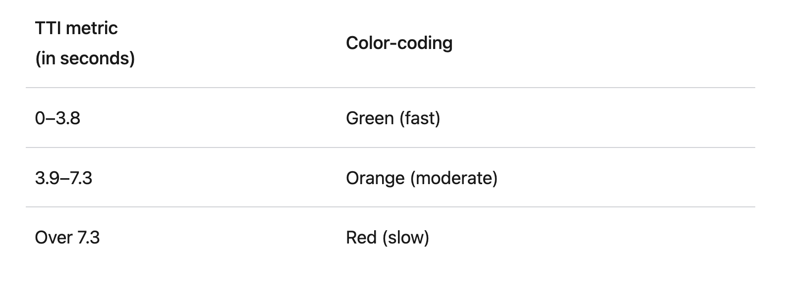
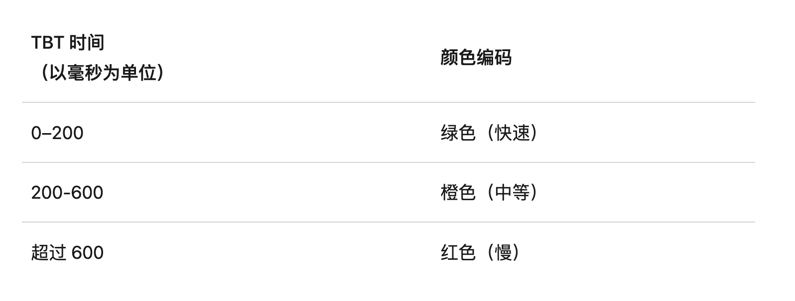
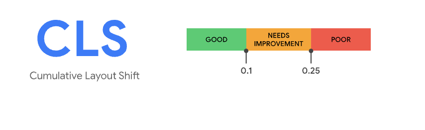
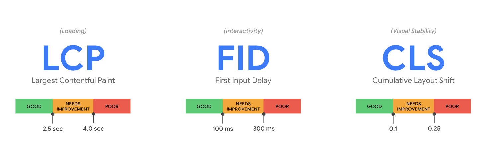

## 1. 性能优化指标

测量工具：

- lighthouse

- https://webpagetest.org
- [PageSpeed Insights (web.dev)](https://pagespeed.web.dev/)
- [GTmetrix | Website Performance Testing and Monitoring](https://gtmetrix.com/)

Lighthouse 计算公式：

各项指标标准：

| 指标                                                                                                                                                                                                                                                | 标准                                                                           |
| --------------------------------------------------------------------------------------------------------------------------------------------------------------------------------------------------------------------------------------------------- | ------------------------------------------------------------------------------ |
| [FCP (First Contentful Paint)](https://web.dev/fcp/)： 页面加载时，首次渲染出内容所消耗的时间                                                                                                                                                       |  |
| [SI (Speed Index)]([Speed Index (web.dev)](https://web.dev/speed-index/)): 网页内容的可见填充速度                                                                                                                                                   |  |
| [LCP (Largest Contentful Paint)](https://web.dev/lcp/)：页面加载时，渲染出最大内容所消耗的时间                                                                                                                                                      |  |
| [TTI (Time to Interactive)]([Time to Interactive (web.dev)](https://web.dev/interactive/?utm_source=lighthouse&utm_medium=devtools)): 网页需要多长时间才能提供完整交互功能                                                                          |  |
| [TBT (Total Blocking Time)]([总阻塞时间 (web.dev)](https://web.dev/lighthouse-total-blocking-time/?utm_source=lighthouse&utm_medium=devtools))：首次内容渲染 (FCP) 和可交互时间之间的所有时间段的总和，当任务用时超过 50 毫秒时，该数值以毫秒表示。 |  |
| [CLS (Cumulative Layout Shift)]([Cumulative Layout Shift 累积布局偏移 (CLS) (web.dev)](https://web.dev/cls/?utm_source=lighthouse&utm_medium=devtools))：可见元素在视口内的移动情况                                                                 |  |

核心[性能优化指标](https://web.dev/vitals/)：

1. [**Largest Contentful Paint (LCP)**](https://web.dev/lcp/)：加载性能，页面加载时，渲染出最大内容所消耗的时间
2. **[First Input Delay (FID)](https://web.dev/fid/)**：首次交互的响应速度，该指标需要真实用户对页面进行操作，因此在 lighthouse 中使用 TBT 指标进行测量与计算。
3. **[Cumulative Layout Shift (CLS)](https://web.dev/cls/)** ：视觉稳定性，可见元素在视口内的移动情况

在 JavaScript 中测量这些指标：

1. 使用 Web API[**`PerformanceObserver`**]([性能监测对象 - Web API 接口参考 | MDN (mozilla.org)](https://developer.mozilla.org/zh-CN/docs/Web/API/PerformanceObserver))
2. 使用 chrome 基于 PerformanceObserver 封装的[web-vitals]([GitHub - GoogleChrome/web-vitals: Essential metrics for a healthy site.](https://github.com/GoogleChrome/web-vitals))
